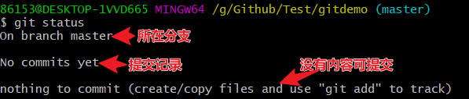
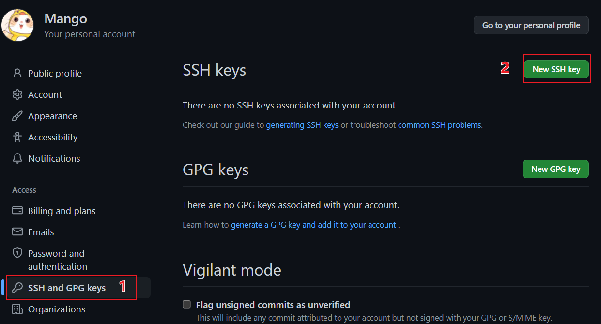

# Github


# Git

## Git邮箱-ssh密钥邮箱-Github邮箱配置

```shell
1. 在电脑上，如果要用Git，我们需要通过命令git config --global user.name "myname"和git config --global user.email "myname@email.com"来配置用户名和email，表明是“谁”在操作Git，来做提交代码等等一系列操作。
2. 如果我们需要使用代码托管的服务，比如GitHub，GitHub也会要求我们提供email和用户名来注册来注册，也需要用户名和email。
3. 如果我们选择用ssh来访问GitHub的话（比用https方便，https每次都需要输入用户名密码），需要产生密钥对，很多人推荐的产生秘钥对的方法是用命令ssh-keygen -t rsa -C "myname@email.com"，又要提供一个email。
这三个地方的email到底什么关系，该怎么设置呢？


SSH方式产生本地密钥对，然后把公钥加入到代码托管网站的秘钥允许列表里面，把公钥加入到网站的允许列表这一步是需要密码授权的。这样操作，网站承认这样一个事实：用这个密钥对访问我，等同于提供了密码。密钥对保存在某台机器上，这样从这台机器上访问网站就不需要密码了，因为这台机器上能找到秘钥来替代口令进行认证。
如果用https的方式，就不用产生什么密钥对了，但是，每次都输入密码，不方便。
# 结论1：产生ssh密钥对时，ssh-keygen -t rsa -C "myname@email.com"，里面输入的email与Git设定的用户名，与GitHub等代码托管网站的用户名毫无关联。
#推荐做法：每台电脑上产生秘钥对时，加注释信息内容主要跟这台机器相关的内容，并且把秘钥加入到代码托管网站的列表里面的时候，用这个跟某台电脑密切相关的名称。以后如果，不用这台电脑了，从网站上删除这个秘钥很方便。

代码托管网站，主要看email，用email地址来匹配自己的账户名的邮件地址，如果相同，代码托管网站就认为此操作是账户所有者的操作。
# 结论2：配置本地git用户名时，全局配置（–global）考虑该电脑上的工作主要push到哪个服务器，配置成跟那个服务器一致的用户名和邮件地址最好。
```


## Git分布式版本控制

- 工作机制及托管中心介绍


- 代码托管中心是基于网络服务器的远程代码仓库，简称远程库。（push）


## Git基本用法

### 基础命令


```shell
# linux安装Git
sudo apt update
sudo apt upgrade
sudo apt install git
git --version
# 设置用户签名
只需设置一次，但必须设置，否则无法提交代码。执行完下列命令，可以在用户加目录"C:\Users\86153"查看到".gitconfig"的文件。签名的作用是区分不同操作者身份，用户的签名信息在每一个版本的提交信息中能够看到；这里设置用户签名和登录Github（或其他代码托管中心）的账号没有任何关系。
git config --global user.name mango
git config --global user.email virtual@.com
# 初始化本地库
git init
# 查看本地库状态
git status
# 文件添加到暂存区
git add 文件名
# 将文件从暂存区删除(本地目录的工作区中的文件还在)
git rm --cached hello.txt
# 将所有文件从暂存区删除
git rm --cached -r *
# 删除文件夹及文件夹中的文件
git rm --cached dir_
# 将暂存区的文件提交到本地库
git commit -m "日志信息" 文件名
# 将所有暂存区文件提交到本地库
git commit -m "日志信息"
# 查看精简历史信息(精简版本号、分支、日志)
git reflog
# 查看详细历史信息（详细版本号、提交者信息、提交日期）
git log
# 版本穿梭（通过HEAD指向的版本号，实现向前穿梭、向后穿梭）
git reset --hard 版本号
# 克隆版本回滚
git checkout b6f4ceae
```

其他命令

```shell
# 把本地所有untrack的文件都加入暂存区，并且会根据.gitignore做过滤
git add .
# 把本地所有untrack的文件都加入暂存区，会忽略.gitignore
git add *
```

### 命令图示

查看本地库状态



在工作区新建一个hello.txt文件后（红色表示文件未被追踪！）


将hello.txt提交到暂存区。将文件从**暂存区**（工作区中文件还在）中删除"git rm --cached hello.txt"


将文件从暂存区提交到本地库


查看提交信息


查看提交者信息


**修改已提交到本地库的文件**（修改后红色表示此时文件未被追踪）


将修改后的文件**再次**提交到暂存区


从暂存区中，将修改后的文件再次提交到本地库（指针指向第二个版本！）


从第二个版本回到第一个版本（也可以从第一个版本再次返回第二个版本！）


版本穿梭示意图


### Git_分支


```
# 查看分支
git branch -v
# 创建分支
git branch 分支名
# 切换分支(工作区文件对应当前指向的分支)
git checkout 分支名
# 合并分支(把指定的分支合并到当前分支上)
git merge 分支名
```

查看分支


创建分支


切换分支


合并分支


冲突合并（手动编辑冲突文件进行修改）


合并分支只会修改合并的分支。修改完冲突代码后，需要重新提交文件；而且commit不能带文件名


### Git_团队协作

团队内协作


跨团队协作


### Git_Github


```shell
# 查看当前远程库别名
git remote -v
# 给远程库起别名
git remote add 别名 远程地址 # 远程地址是http链接
# git命令行中的复制快捷键
Shift+Insert
# 推送本地库分支内容到远程仓库（需要验证账号）
git push 别名 分支
# 将远程仓库对于分支最新内容拉下来后与当前本地分支直接合并。拉取动作会自动提交到本地库
git pull 远程库地址别名 远程分支名
# 针对上传和拉取问题，有时需要关闭ssl验证
git config --global http.sslVerify "false"
# 将远程仓库的内容克隆到本地(不需要验证账号)：1拉取代码；2初始化本地库；3远程库取别名为"origin"
git clone 远程地址
# 进入到用户家目录"C:\Users\86153"打开Git，输入以下命令生成ssh密钥
ssh-keygen -t rsa -C 2965531503@qq.com #邮箱是Github账号的邮箱
# 测试ssh是否配置成功
ssh -T git@github.com  # ssh -T -p 443 git@ssh.github.com
```

给远程库创建别名


**推动本地库分支内容到远程库**

- 打开“凭据管理器”，查看是否有证书凭据

  

- 授予许可：授权后就会增加github的普通凭据

  

- 推送成功

  

**拉取远程库到本地库**

- Github网页对文件进行编辑修改并"commit"后，如何拉取到本地库

- 接触SSL验证后，拉取成功（拉取动作会自动提交到本地库）

  

**将远程库克隆到本地**


​	克隆会自动给远程库取别名为"origin"


Git团队内协作：A账号push的代码。B账号克隆下来进行编辑修改后，再push到A的github项目中。

- 需要在A的github项目中，添加B为团队成员

  

  ​	A账号添加邀请B，生成邀请链接发送给B账号

  

  ​	B账号接收A的团队邀请，就可以push代码到远程库！

  

Git跨团队协作：fork()


SSH免密登录：设置ssh后，可以免密拉取

```
# 进入到用户家目录"C:\Users\86153"打开Git，输入命令
ssh-keygen -t rsa -C "2965531503@qq.com" #邮箱是Github账号的邮箱
```

​	生成".ssh"文件夹，包含公钥和私钥


​	将公钥内容添加到Github账号中




### 问题汇总

问题1描述：


解决方法：

​	进入.git目录下的config文件


​	将url地址改为ssh地址


问题2描述：


解决方法：

```shell
1. 进入凭据管理器，删掉

2. 解除SSL认证
输入命令： git config --global http.sslVerify "false"

3. 开代理

4.更新 DNS 缓存
ipconfig /flushdns

5. 国内对github完全封死，造成DNS域名解析错误，即便翻外网进去也不能直接拉代码【见下图】

# 查看用户名
git config user.name
git config user.email

# 针对上传和拉取问题，有时需要关闭ssl验证
git config --global http.sslVerify "false"
# 进入到用户家目录"C:\Users\86153"打开Git，输入以下命令生成ssh密钥
ssh-keygen -t rsa -C "2965531503@qq.com" #邮箱是Github账号的邮箱
# 测试ssh是否配置成功
ssh -T git@github.com  # ssh -T -p 443 git@ssh.github.com
```


### 官方教程

[Github身份验证教程](https://docs.github.com/cn/authentication/connecting-to-github-with-ssh/generating-a-new-ssh-key-and-adding-it-to-the-ssh-agent)

```shell
ssh -T -p 443 git@ssh.github.com   #测试SSH端口是否正常


git clone ssh://git@ssh.github.com:443/YOUR-USERNAME/YOUR-REPOSITORY.git  #克隆


eval "$(ssh-agent -s)"   #在后台启动 ssh-agent
ssh-agent -s   #在后台启动 ssh-agent


ssh-add -l -E sha256   #确认您的私钥已生成并加载到 SSH【打印出内容】


ssh -T git@github.com  #验证链接
```

- Connect with SSH

```shell
ls -al ~/.ssh  #检查是否已经存在密钥


ssh-keygen -t ed25519 -C "your_email@example.com"  #生成密钥
ssh-keygen -t rsa -b 4096 -C "your_email@example.com"  #生成密钥. If you are using a legacy system that doesn't support the Ed25519 algorithm, use.


ssh-add ~/.ssh/id_ed25519  #将ed25519私钥文件添加到ssh-agent
clip < ~/.ssh/id_rsa.pub   #复制公钥文件到剪切板【添加到Github】


ssh-keygen -p -f ~/.ssh/id_rsa   #添加或更改现有私钥的密码而无需重新生成密钥对
```

# 工具

## Git可视化管理工具


### Sourcetree

- Bitbucket邮箱账号


- Sourcetree配置


## 查找工具

Everything


