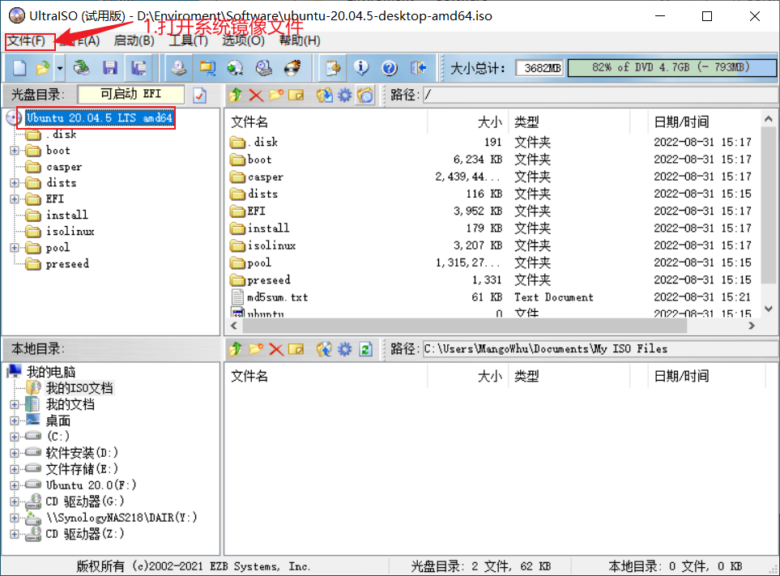
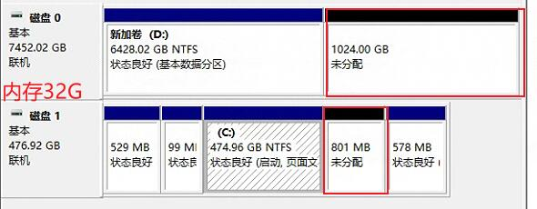
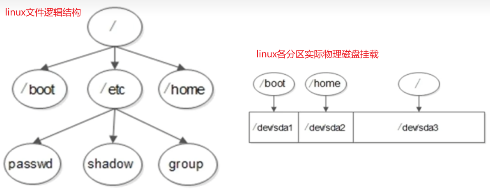
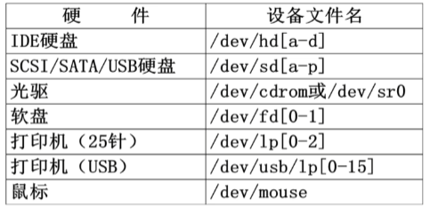
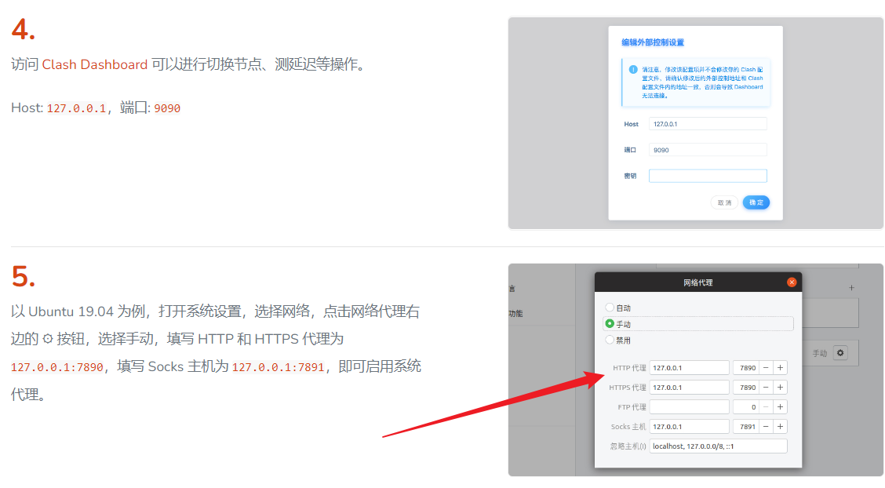

# Linux

## ubuntu系统安装【windows装ubuntu】

- 双系统安装

```shell
# 使用UltraISO制作启动U盘
写入硬盘镜像

# 确认硬盘个数、硬盘格式
win+r输入msinfo32  查看BIOS模式：MBR、UEFI
磁盘管理  查看磁盘个数
磁盘管理->属性  查看磁盘分区形式：MBR、GPT

# 创建linux磁盘分区
linux的/boot启动分区要预留在windows系统磁盘中

# 安装系统
设置分区挂载：/根分区、swap分区、/boot启动分区
swap分区：交换分区，虚拟内存分区，内存2倍，不超过2GB
/boot分区：启动分区，200MB【一定要挂载在系统启动硬盘上，否则BIOS无法找到系统】
```

【图】：制作启动U盘




【图】：压缩卷->创建未分配磁盘分区



【图】：安装类型->其他 。一定要设置对启动分区的位置，否则系统无法正常启动


【图】linux文件逻辑结构与各分区实际物理挂载存储



- 系统分区

```shell
# linux分区有：主分区、扩展分区、逻辑分区
主分区：最多只能有4个，且主分区加扩展分区最多只能有4个
扩展分区：最多只能有一个。不能呢过写入数据，只能包含逻辑分区
逻辑分区
# 文件系统
【概念】：硬盘格式化的过程就是创建文件系统
Windows常用文件系统：FAT16、FAT32、NTFS
Linux常用文件系统：EXT2、EXT3、EXT4
# 创建可用存储空间
Windows三步：硬盘分区【类似GPT、MBR分区】->格式化【创建文件系统】->创建盘符【D、E】
Linux四步：硬盘分区->格式化->创建设备文件名->挂载【根分区、启动分区的物理挂载】
```

【图】硬盘设备文件名：现在常用SATA硬盘，读写快



## 远程链接

- ssh远程

可以配合MobaXterm、XShell等工具

```shell
sudo apt-get install openssh-server -y  # 安装ssh
sudo ufw disable #关闭防火墙
sudo ufw enable #开启防火墙
sudo ufw status #查看防火墙状态
service sshd start #启动 SSHD 服务
service sshd status  #查看ssh状态【active(running)】
```

- 向日葵远程

安装显示

```shell
sudo dpkg -i SunloginClient-10.0.2.24779_amd64.deb  #安装向日葵包
sudo apt-get install lightdm  #安装lightdm
sudo dpkg-reconfigure lightdm  #设置lightdm为默认桌面
sudo dpkg-reconfigure gdm3  #设置gdm3为默认桌面
sudo reboot  #重启计算机
sudo service lightdm stop  #关闭lightdm
sudo service lightdm start  #开启lightdm
```

设置开启启动

```shell
gnome-session-properties   #打开设置窗口
sudo dpkg -L sunloginclient   #查看向日葵安装路径
点击Add添加向日葵路径：/usr/local/sunlogin/bin/sunloginclient
```

## 基础配置

###  网络配置

- 设置静态IP

```shell
sudo apt update && sudo apt upgrade   #更新软件
sudo apt install net-tools  #安装网络管理工具包
ifconfig   #查看网络配置
```


### 用户管理

- 配置root用户

```shell
sudo passwd root  #设置root用户密码
su root  #切换到root用户
su "username"  #切换到普通用户
```


### 编辑器


### 常见问题

- 中文输入法问题

安装googlepinyin

```shell
sudo apt install fcitx -y   #google输入法是基于fcitx输入法的
im-config  #配置fcitx
sudo reboot

sudo apt install fcitx-googlepinyin  #安装
fcitx-config-gtk3  #配置谷歌拼音输入法
sudo reboot
【用法】ctrl+space #切换中英文输入
```


## 常用命令

- linux终端输入快捷键

```shell
ctrl+u # 删除命令行开始至光标处
ctrl+k # 删除光标处至命令行结尾
ctrl+a # 光标移动到最前面
ctrl+e # 光标移动到最后面

```

- 软件下载


- 增删改查 文件夹/文件

查找库路径

```shell
dpkg --list | grep mysql  #列出所有的mysql安装包
dpkg -L libmysqlclient-dev #查找libmysqlclient-dev的所有安装文件
```

安装卸载库

```shell
sudo apt-get install meshlab  #安装库
sudo apt-get remove meshlab  #卸载库
```


文件夹

```shell
rm -r 目录名     #删除一个非空目录
rm 文件名     #删除文件

sudo cp -r 文件夹路径/文件夹名 目标文件夹路径   #复制文件夹到某路径

mv 文件夹名1 文件夹名2    #移动文件夹

ls -a  #显示
```

解压文件

```shell
tar -zvxf pycharm-professional-2022.1.3.tar.gz  #解压文件
```

增加文件写权限

```shell
 chmod +x clash  #增加对clash文件的写权限
```


- 配置库搜索路径

```shell
/etc/ld.so.conf  #将路径写入此文件
sudo ldconfig  #启动配置
/usr/lib/x86_64-linux-gnu/dri  #示例
```


- 目录结构
- vim编辑快捷键

```shell
q! #强制退出且不保存
u  #退回到上一步
```

- 进程管理

```shell
gnome-system-monitor   #打开任务管理器
```


- 磁盘挂载

## 常用软件安装

### chrome

```shell
wget https://dl.google.com/linux/direct/google-chrome-stable_current_amd64.deb  #下载
sudo apt install ./google-chrome-stable_current_amd64.deb  #安装
```


### 代理安装

```shell
https://jike391.com/auth/login

1）下载clash和配置文件

2）解压，修改程序和配置文件的名称

3）sudo ./clash -d .  #命令启动 Clash，同时启动 HTTP 代理和 Socks5 代理

4）配置"网络代理"

访问 Clash Dashboard 可以进行切换节点、测延迟等操作。
Host: 127.0.0.1，端口: 9090
```

使用说明



### CloudCompare

```shell
sudo apt-get install snapd   #安装snap
sudosnap install cloudcompare   #安装cloudcompare
cloudcompare.CloudCompare   #启动软件
```


