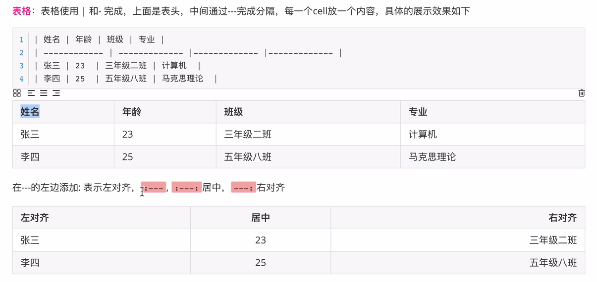

# 链接跳转

## 文档间跳转

- 相对路径

```shell
# 路径表示
../ 表示当前目录上一级
./ 表示当前目录

# 语法
[添加对象](路径)	//括号均为英文

# 向下跳转
[content](/content)
[第一章](/content/C1.md)

# 同级跳转
[下一章](./C2.md) 	//C1.md

# 向上跳转
[返回目录](../README.md) //C2.md
```

- 绝对路径

```shell
# 返回目录，这采用HTML写法
<a href="https://github.com/BackMountainDevil/The-C-Programming-Language#the-c-programming-language">返回目录</a>

# 返回目录，md（Markdown）写法
[返回目录](https://github.com/BackMountainDevil/The-C-Programming-Language#the-c-programming-language)
```


## 页内跳转

- md方式

```shell
# 支持跳转到标题
[跳到一级标题A](#A)

# 支持跳转到网页资源
[对象名](url)
```

- html方式

```shell
# 锚点，快捷方式
1.定义锚点
<span id='wh'>武汉</span>

2.链接锚点
<a href='#wh'></a>
```


# md语法

## 简介

MD是轻量级的标记语言，HTML超文本标记语言。

MD的设计是为了方便协作，可以转换为HTML。

MD兼容HTML。

## 语法

```shell
1.标题
# 一级标题
<h1>一级标题</h1>

2.文本
斜体：*obj* 或 _obj_
html：<em>obj</em>
粗体：**obj** 或 __obj__
html：<b> 或 <strong>
删除线：~~obj~~
html：<strike> 或 <del>
下划线：
html：<u>
有序列表：
	数字+.+space
	【tab缩进，shift+tab取消缩进】
无序列表：
	-+sapce
超链接：[obj](url)
html：<a href="url">obj</a>
引用：> 【可以嵌套使用】
空格：
	&nbsp;  等价于space
	&ensp;  半个中文字符宽度，半角空格
	&emsp;  1个中文字符宽度，全角空格
换行：enter
html：<br/>
横线：---
html：<hr/>

3.其他
图片：
表格：| 和 -
行内代码：`obj`
块内代码：```obj```
任务清单：-space[space]sapce任务1
表情：
	win + .
	:smile:
视频：<video src="url"/>
```

## 展示

【引用例子】

>百度
>
>阿里
>
>> 腾讯

【横线例子】

---

<hr/>

【空格例子】

&nbsp;

【表格例子】



【任务清单例子】

- [ ] 任务1
- [x] 任务2

【视频语法例子】

```shell
# 命令
<video id="video" controls=""src="TyporaImg/网络模型汇总/seq2seq_3.mp4" preload="none">
```


