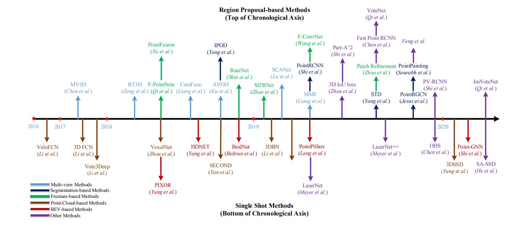
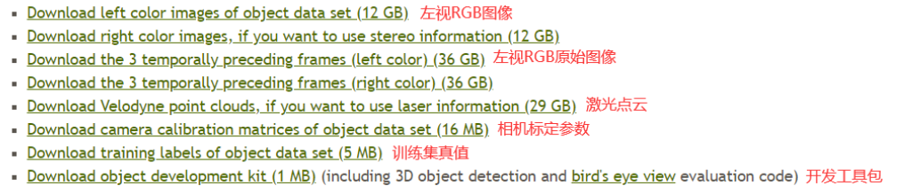
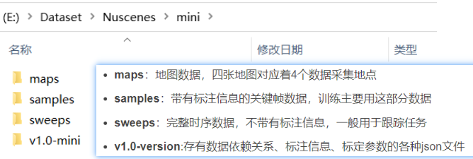

# 3D目标检测

## 研究进展

参考引用：[CSDN]( https://blog.csdn.net/weixin_45429089/article/details/117409515)

## 数据集

### KITTI 3D数据集

[参考引用：KITTI数据集解析](https://blog.csdn.net/qq_16137569/article/details/118873033)

### Waymo Open Dataset

下载链接：https://waymo.com/open

### NuScenes DataSet

下载链接：https://www.nuscenes.org/nuscenes#download

**完整数据集包含3个部分:**

- Mini：从训练/验证集抽取10个场景组成，包含完整的原始数据和标注信息，主要用于数据集的熟悉；
- TrainVal：训练/验证集，包含850个场景，其中700个训练场景，150个验证场景
- Test：测试集，包含150个场景，不包含标注数据。

【图】nuscenes数据集组织

### 图像检测数据集

, and MS COCO datasets with

|         名称          |     任务     |       数据集描述       | 下载 |
| :-------------------: | :----------: | :--------------------: | :--: |
|         MNIST         | 手写数字识别 |                        |      |
|     CIFAR-10/100      |   图像分类   | 60000张32乘32的RGB图像 |      |
|         COCO          |              |                        |      |
| PASCAL VOC 2007, 2012 |              |                        |      |

**COCO数据集**

**VOC数据集**

## 论文

[3D目标检测论文汇总](https://blog.csdn.net/weixin_45429089/article/details/117409515)
