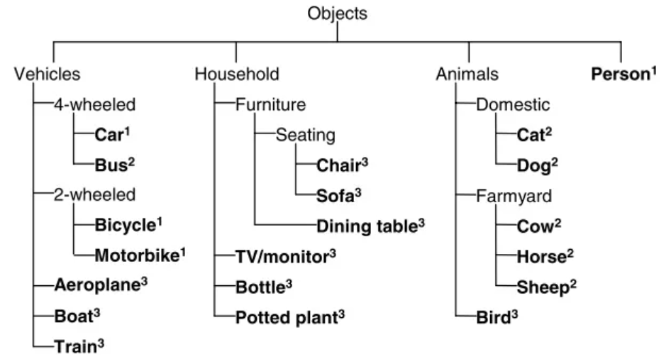
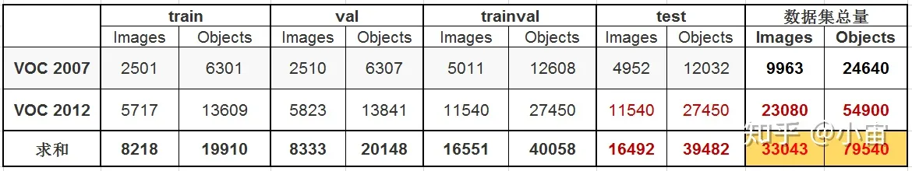

# 3D目标检测

## 研究进展


参考引用：[CSDN]( https://blog.csdn.net/weixin_45429089/article/details/117409515)

## 数据集

### KITTI 3D数据集

[参考引用：KITTI数据集解析](https://blog.csdn.net/qq_16137569/article/details/118873033)


### Waymo Open Dataset

下载链接：https://waymo.com/open

### NuScenes DataSet

下载链接：https://www.nuscenes.org/nuscenes#download

**完整数据集包含3个部分:**

- Mini：从训练/验证集抽取10个场景组成，包含完整的原始数据和标注信息，主要用于数据集的熟悉；
- TrainVal：训练/验证集，包含850个场景，其中700个训练场景，150个验证场景
- Test：测试集，包含150个场景，不包含标注数据。

【图】nuscenes数据集组织


### 图像检测数据集

MS COCO datasets

|         名称          |     任务     |       数据集描述       | 下载 |
| :-------------------: | :----------: | :--------------------: | :--: |
|         MNIST         | 手写数字识别 |                        |      |
|     CIFAR-10/100      |   图像分类   | 60000张32乘32的RGB图像 |      |
|         COCO          |              |                        |      |
| PASCAL VOC 2007, 2012 |              |                        |      |

### **COCO数据集**

### **VOC数据集**

```shell
PASCAL VOC数据集共有4大类，vehicle ,household, animal, person，20小类。数据集主要关注分类和检测任务。
```

- 数据标注类别



```shell
现在研究常用的数据集是VOC2007和VOC2012，VOC07包含9963张图片，总共24640物体，VOC12包含23080张图片，总共54900物体。
```



- 标注信息

```shell
<annotation>
	<folder>VOC2007</folder>
	<filename>000001.jpg</filename>
	<source>
		<database>The VOC2007 Database</database>
		<annotation>PASCAL VOC2007</annotation>
		<image>flickr</image>
		<flickrid>341012865</flickrid>
	</source>
	<owner>
		<flickrid>Fried Camels</flickrid>
		<name>Jinky the Fruit Bat</name>
	</owner>
	<size>    //图片尺寸
		<width>353</width>
		<height>500</height>
		<depth>3</depth>
	</size>
	<segmented>0</segmented>   //是否分割
	<object>   //表明是否是一个目标，包含了目标的详细信息
		<name>dog</name>    //20类别之一
		<pose>Left</pose>    //拍摄角度 left right front rear unspecified
		<truncated>1</truncated>    //目标是否被截断（）比如在图片之外），或者被遮挡（超过15%）
		<difficult>0</difficult>    //检测难易程度，主要依据目标大小，光照变化，图片质量来判断的，图中用虚线dashed来标识
		<bndbox>    //bounding box左上角和右下角的4个坐标值
			<xmin>48</xmin>
			<ymin>240</ymin>
			<xmax>195</xmax>
			<ymax>371</ymax>
		</bndbox>
	</object>
	<object>
		<name>person</name>
		<pose>Left</pose>
		<truncated>1</truncated>
		<difficult>0</difficult>
		<bndbox>
			<xmin>8</xmin>
			<ymin>12</ymin>
			<xmax>352</xmax>
			<ymax>498</ymax>
		</bndbox>
	</object>
</annotation>
```


## 论文

[3D目标检测论文汇总](https://blog.csdn.net/weixin_45429089/article/details/117409515)
