# OpenMMLab

## 架构


# MMCV

## 基础介绍

- 底层库，提供以下功能

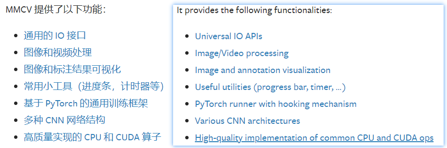

- 安装

```shell
pip install -U openmim
mim install mmcv-full
```

## 主要模块

### 配置-config

`Config` 类用于操作配置文件，它支持从多种文件格式中加载配置，包括 **python**, **json** 和 **yaml**。 

### 注册器-registry

MMCV 使用 [注册器](https://github.com/open-mmlab/mmcv/blob/master/mmcv/utils/registry.py) 来管理具有相似功能的不同模块, 例如, 检测器中的主干网络、头部、和模型颈部。 在 OpenMMLab 家族中的绝大部分开源项目使用注册器去管理数据集和模型的模块，例如 [MMDetection](https://github.com/open-mmlab/mmdetection), [MMDetection3D](https://github.com/open-mmlab/mmdetection3d), [MMClassification](https://github.com/open-mmlab/mmclassification), [MMEditing](https://github.com/open-mmlab/mmediting) 等。


- 什么是注册器？

在MMCV中，注册器可以看作类或函数到字符串的映射。 一个注册器中的类或函数通常有相似的接口，但是可以实现不同的算法或支持不同的数据集。 借助注册器，用户可以通过使用相应的字符串查找类或函数，并根据他们的需要实例化对应模块或调用函数获取结果。 一个典型的案例是，OpenMMLab　中的大部分开源项目的配置系统，这些系统通过配置文件来使用注册器创建钩子、执行器、模型和数据集。

- 使用 `registry`（注册器）管理代码库中的模型，需要以下三个步骤。

1. 【builder】创建一个构建方法（可选，在大多数情况下您可以只使用默认方法）
2. 创建注册器
3. 使用此注册器来管理模块

### 执行器-runner

执行器模块负责模型训练过程调度，主要目的是让用户使用更少的代码以及灵活可配置方式开启训练。

### 文件输入输出-file io

### 数据处理-data process

### 可视化-visualization

### 卷积神经网络-cnn

我们为卷积神经网络提供了一些构建模块，包括层构建、模块组件和权重初始化。

### 算子-ops

### 辅助函数-utils

进度条track_progress、计时器Timer


# mmdetection

## Windows安装问题

- 库网络下载问题

```shell
# 问题描述
pip._vendor.urllib3.exceptions.ReadTimeoutError: HTTPSConnectionPool(host='files.pythonhosted.org', port=443): Read timed out.

# 解决：设置镜像源
pip install -v -e . -i https://pypi.tuna.tsinghua.edu.cn/simple 
```

- 源码版本回退

```shell
git checkout v2.24.0
```


## 流程抽象


## 核心组件


# mmdetction3d

## 安装配置

- 安装命令

```shell
# 1.安装anaconda
# 2.新建python虚拟环境
conda create --name openmmlab python=3.8 -y
conda activate openmmlab
# 3.安装pytorch
conda install pytorch==1.11.0 torchvision==0.12.0 torchaudio==0.11.0 cudatoolkit=11.3 -c pytorch
# 4.安装MMCV
pip install mmcv-full -f https://download.openmmlab.com/mmcv/dist/cu113/torch1.11/index.html
#5.安装依赖检查
【确认没有依赖报错】
pip install -r requirements.txt
【安装库】
python setup.py develop
pip install -e .
```

- 官方安装

```shell
pip install openmim
mim install mmcv-full
mim install mmdet
mim install mmsegmentation
git clone https://github.com/open-mmlab/mmdetection3d.git
cd mmdetection3d
pip install -e .
```

- 检查环境版本

```python
import torch
torch.cuda.is_available()

from mmcv.ops import get_compiling_cuda_version,get_compiler_version
print(get_compiler_version)
print(get_compiler_version())

```


## Demo

### Single-modality demo

- Demo

```shell
python demo/pcd_demo.py ${PCD_FILE} ${CONFIG_FILE} ${CHECKPOINT_FILE} [--device ${GPU_ID}] [--score-thr ${SCORE_THR}] [--out-dir ${OUT_DIR}] [--show]

python demo/pcd_demo.py demo/data/kitti/kitti_000008.bin configs/second/hv_second_secfpn_6x8_80e_kitti-3d-car.py checkpoints/hv_second_secfpn_6x8_80e_kitti-3d-car_20200620_230238-393f000c.pth --out-dir output  #示例
```


### Multi-modality demo

```shell
python demo/multi_modality_demo.py ${PCD_FILE} ${IMAGE_FILE} ${ANNOTATION_FILE} ${CONFIG_FILE} ${CHECKPOINT_FILE} [--device ${GPU_ID}] [--score-thr ${SCORE_THR}] [--out-dir ${OUT_DIR}] [--show]

python demo/multi_modality_demo.py demo/data/kitti/kitti_000008.bin demo/data/kitti/kitti_000008.png demo/data/kitti/kitti_000008_infos.pkl configs/mvxnet/dv_mvx-fpn_second_secfpn_adamw_2x8_80e_kitti-3d-3class.py checkpoints/dv_mvx-fpn_second_secfpn_adamw_2x8_80e_kitti-3d-3class_20210831_060805-83442923.pth --out-dir output
```


## 运行环境问题

- 显示：libGL, fbConfigs, visuals, swrast相关错误

```shell
sudo apt-get install libgl1-mesa-dri  #安装
```

- spconv版本问题

```shell
pip install spconv-cu113 #使用pip安装的是cpu版本，不适用与gpu运算的模型。指定安装对应cuda版本的库
```

## 架构

### 目录结构


## 训练-验证-测试

### 显卡监视

```shell
# 查询显卡使用r信息
nvidia-smi -l seconds
nvidia-smi --loop=seconds
```

### 问题

1. spconv运行时报错


## 评价结果

### KITTI标注数据说明


```shell
Car 0.00 2 -1.55 548.00 171.33 572.40 194.42 1.48 1.56 3.62 -2.72 0.82 48.22 -1.62

type标签是Car，说明该物体是车类，如果是Dont Care，表示该物体不纳入目标检测情况之内。
truncated标签是0，说明这个目标在RGB图像边界内，如果等于1，说明该目标卡在边界上了。
occluded标签是2，说明这个目标有很大一部分被遮挡住了。
alpha标签是-1.55，换算为角度约是-88deg，表示观测该物体的角度。
bbox标签是548.00 171.33 572.40 194.42，分别表示该物体在RGB图像上，相应2D框的左上角和右下角顶点的像素坐标。
dimensions标签是1.48 1.56 3.62，表示目标的高度，宽度，和长度，单位是米。
location标签是-2.72 0.82 48.22，表示目标中心的位置，单位是米。
rotation_y标签是-1.62，换算为角度约是-92deg，表示物体自身旋转角，这里表示这个物体大概是横着出现在观察者的视线内。
score只用于网络预测，真值是1，网络预测值是在[0,1]范围之内，表示目标检测置信度。
```

### KITTI数据集检测指标

- 四种指标

| 指标 |           描述           |
| :--: | :----------------------: |
| bbox |     2D检测框的准确率     |
| bev  | BEV视图下检测框的准确率  |
|  3d  |     3D检测框的准确率     |
| aos  | 检测目标旋转角度的准确率 |


- 三列：Easy、Medium、Hard

### pointpillars模型测试结果


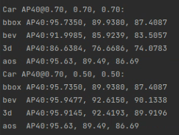

# 目标检测评价指标

## 精度评价指标

```shell
精度评价指标：map（平均准确度均值，精度评价），准确率 （Accuracy），混淆矩阵 （Confusion Matrix），精确率（Precision），召回率（Recall），平均正确率（AP），mean Average Precision(mAP)，交除并（IoU），ROC + AUC，非极大值抑制（NMS）
```

### IOU

定义：交并比

公式： IoU = (A∩B) / (A∪B) 

一般可以设置当`IoU`的值大于`0.5`的时候，则可认为检测到目标物体。

### 准确率/精度/召回率/FPR/F1指标

```shell
预测值为正例，记为P（Positive）
预测值为反例，记为N（Negative）
预测值与真实值相同，记为T（True）
预测值与真实值相反，记为F（False）

TP -- 预测值和真实值一样，预测值为正样本（真实值为正样本）
TN -- 预测值和真实值一样，预测值为负样本（真实值为负样本）
FP -- 预测值和真实值不一样，预测值为正样本（真实值为负样本）
FN -- 预测值和真实值不一样，预测值为负样本（真实值为正样本）
```

1. 准确率

```shell
accuracy = (TP+TN)/(TP+TN+FP+FN)
```

2. 精度

```shell
 precision = TP/( TP+FP)
```

3. 召回率/TPR

```shell
recall/TPR  = TP/(TP+FN)
```

4. FPR

```shell
FPR(false positive rate)，它是指实际负例中，错误的判断为正例的比例，这个值往往越小越好。

FPR = FP/(FP+TN)
```

5. F1-Score

```shell
F1分数(F1-score)是分类问题的一个衡量指标。F1分数认为召回率和精度同等重要。它是精确率和召回率的调和平均数，最大为1，最小为0。

F1 = 2TP/(2TP+FP+FN)
```

6. F2/F0.5

```shell
F2分数认为召回率的重要程度是精度的2倍，而F0.5分数认为召回率的重要程度是精度的一半。

Fβ = ((1+β*β)*precision*recall) / (β*β*precision + recall)
```

### PR曲线-AP值

1. PR曲线和AP值

```shell
PR曲线，就是precision和recall的曲线，PR曲线中precision为纵坐标，recall为横坐标。

【评估能力】
如果模型的精度越高，召回率越高，那么模型的性能越好。也就是说PR曲线下面的面积越大，模型的性能越好。
【优缺点】
PR曲线反映了分类器对正例的识别准确程度和对正例的覆盖能力之间的权衡。
PR曲线有一个缺点就是会受到正负样本比例的影响。比如当负样本增加10倍后，在racall不变的情况下，必然召回了更多的负样本，所以精度就会大幅下降，所以PR曲线对正负样本分布比较敏感。
```


2. AP

```shell
AP即Average Precision，称为平均准确率，是对不同召回率点上的准确率进行平均，在PR曲线图上表现为PR曲线下面的面积。
AP的值越大，则说明模型的平均准确率越高。
```

### ROC曲线-AUC值

1. ROC曲线

```shell
ROC的全称是Receiver Operating Characteristic Curve，中文名字叫“受试者工作特征曲线”，对于ROC来说，横坐标就是FPR，而纵坐标就是TPR。
当TPR越大，而FPR越小时，说明分类结果是较好的。

【优缺点】
ROC曲线有个很好的特性，当测试集中的正负样本的分布变换的时候，ROC曲线能够保持不变。
ROC曲线可以反映二分类器的总体分类性能，但是无法直接从图中识别出分类最好的阈值，事实上最好的阈值也是视具体的场景所定。ROC曲线一定在y=x之上，否则就是一个不好的分类器。
```


2. AUC值

```shell
AUC是Area under curve的首字母缩写，即ROC曲线下的面积，介于0和1之间。计算方式即为ROC曲线的微积分值，其物理意义可以表示为：随机给定一正一负两个样本，将正样本排在负样本之前的概率。
因此AUC越大，说明正样本越有可能被排在负样本之前，即正样本分类结果越好。
```

### MAP

```shell
mAP是英文mean average precision的缩写，意思是平均精度均值。
AP就是PR曲线下面的面积，是指不同召回率下的精度的平均值。然而，在目标检测中，一个模型通常会检测很多种物体，那么每一类都能绘制一个PR曲线，进而计算出一个AP值。那么多个类别的AP值的平均就是mAP。

mAP衡量的是学出的模型在所有类别上的好坏，是目标检测中一个最为重要的指标，一般看论文或者评估一个目标检测模型，都会看这个值，这个值是在0-1直接，越大越好。
一般来说mAP针对整个数据集而言的，AP针对数据集中某一个类别而言的，而percision和recall针对单张图片某一类别的。
```

### NMS

```shell
多个检测目标时，优先选取置信度高的检测框。再根据IOU的大小，提出超过阈值的其他检测框。
```


## 速度评价指标

```shell
速度评价指标：FPS（即每秒处理的图片数量或者处理每张图片所需的时间，当然必须在同一硬件条件下进行比较）
```

```shell
同一硬件，它的最大FLOPS（每秒运算浮点数代表着硬件性能，理解为计算速度，衡量一个硬件的标准。此处区分FLOPs）是相同的。

不同网络，处理每张图片所需的FLOPs(浮点操作数)是不同的，所以同一硬件处理相同图片所需的FLOPs越小，相同时间内，就能处理更多的图片，速度也就越快。

处理每张图片所需的FLOPs与许多因素有关，比如你的网络层数，参数量，选用的激活函数等等，一般来说参数量越低的网络，FLOPs会越小，保存模型所需的内存小，对硬件内存要求比较低，因此比较对嵌入式端较友好。

FLOPs：floating point operations 指的是浮点运算次数，理解为计算量，可以用来衡量算法/模型的复杂度。
```


# 项目调试

## 源码

### 代码结构

1. mmcv


2. mmdet3d

```shell
# MMDetection3D 代码目录结构，展示主要部分 
mmdetection3d 
   | 
   |- configs                    # 配置文件 
   |- data                       # 原始数据及预处理后数据文件 
   |- mmdet3d  
   |     |- ops                  # cuda 算子（即将迁移到 mmcv 中） 
   |     |- core                 # 核心组件 
   |     |- datasets             # 数据集相关代码 
   |     |- models               # 模型相关代码 
   |     |- utils                # 辅助工具 
   |     |- ... 
   |- tools 
   |     |- analysis_tools       # 分析工具，包括可视化、计算flops等 
   |     |- data_converter       # 各个数据集预处理转换脚本 
   |     |- create_data.py       # 数据预处理入口 
   |     |- train.py             # 训练脚本 
   |     |- test.py              # 测试脚本 
   |     |- ...                       
   |- ... 
```


## 数据流


## 模型架构

## 训练流程


# python编译安装

```shell
pip install .  #安装后的模块freeze在pip/conda依赖下，换句话说，再修改本地的原项目文件，不会导致对应模块发生变化。

pip install -e .  #-e 理解为 editable，修改本地文件，调用的模块以最新文件为准

pip install -v -e .  #-v是指verbose, or more output
```


# PointNet系列

## PointNet

### 点云特征

1. 点云是一个无序性的集合【输入的顺序不能改变模型提取到的特征】

- 解决方法：对称函数【如max函数】

- 如何利用神经网络构造对称函数？

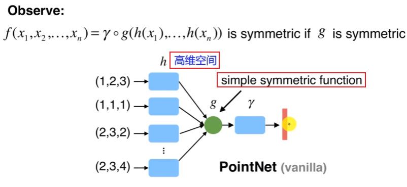

- 采用多层感知机升维，以降低信息的损失

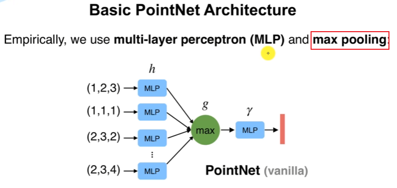

- PointNet的网络结构能够拟合任意的连续集合函数Universal Set Function Approximator【多层感知机也能】

2. 点云集合具有旋转不变性【不同角度看同一个物体的点云，模型输出的分类结果都应该一致】

- 解决方法：设计Transformer网络
- 数据角度自动对阵变换【矩阵乘法】

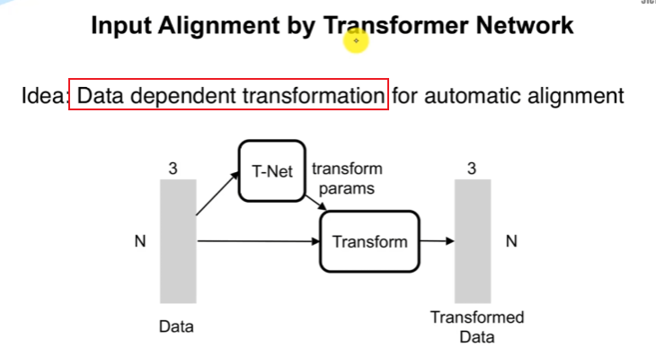

- 特征对准【弃用】


3. 点云近密远疏【采集特征】
4. 点之间具有相互关联的信息，这意味着每个点都不是孤立的，所以需要模型具有可以提取点与相邻点局部特征的能力。

### 网络结构

- 分类网络


- 分割网络

n：输入的点。m：输出的分割类别


### 研究进展

|   点云特征表达    | 举例             |    网络结构     |                          缺点                           |
| :---------------: | ---------------- | :-------------: | :-----------------------------------------------------: |
|  栅格化（体素）   | VoxelNet、SECOND |     3D CNN      |                3D卷积的瓶颈。有信息丢失                 |
|   投影（BEV ）    | MVOD             |     2D CNN      | 虽然时间更快, 但是点云的稀疏性让卷积的不实用,效率很低。 |
| 特征提取/特征学习 | PointNet         | Fully Connected |                        计算复杂                         |

## PointNet++

### 提出背景

- 主要思想：借鉴多层卷积神经网络
- PointNet用最大池化，缺点是每个点其局部特征没有学习到

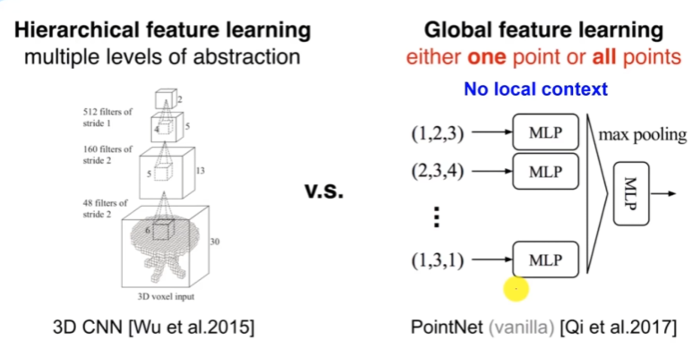

### PointNet++的贡献

1. 多层级（多尺度）特征学习

- 功能：学习每个点的局部特征

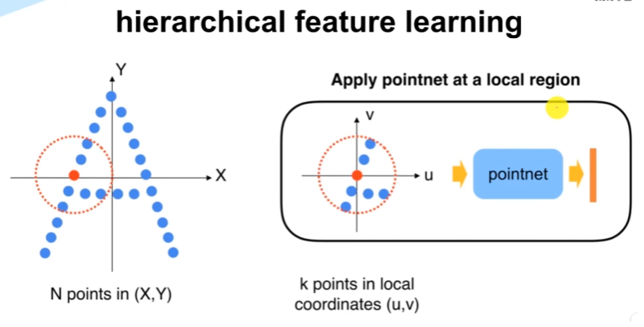

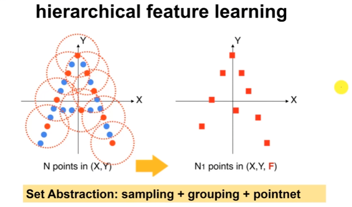

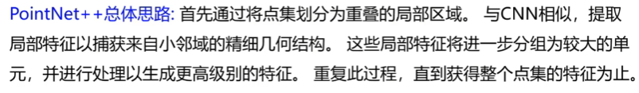

2. 旋转不变性

3. 排列/排序不变性

### 多层级特征提取结构

- 采样

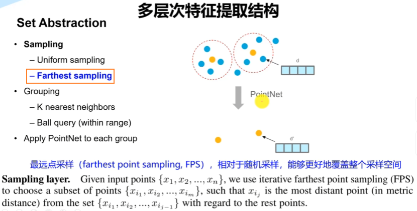

- 分组

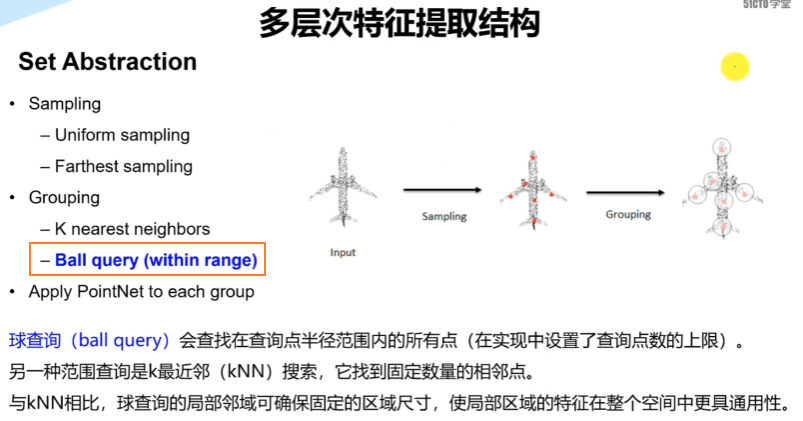

- 特征学习

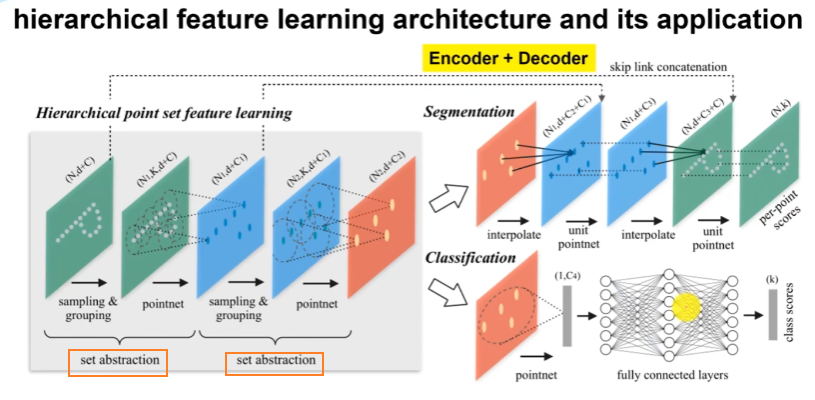

### 对于非均匀点云的处理

- 背景

点云数据具有近密远疏的特征。

- 方法【特征拼接】

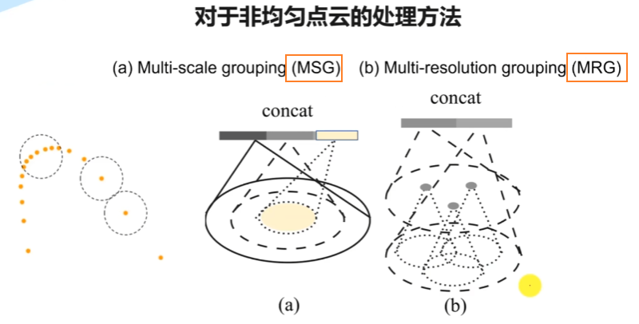

## 代码实战

### 环境

- 配置pytorch

```shell
python3.7
conda install pytorch==1.1.0 torchvision==0.3.0 cudatoolkit=10.0 -c pytorch
```

- 拉取项目代码

```shell
git clone https://github.com/yanx27/Pointnet_Pointnet2_pytorch.git
```


# ResNet-VGG

# Faster-RCNN、Yolo、SSD、RetinaNet


# Voxel-Second-Pointpillars

# PointRCNN-PVRCNN-PV++RCNN

# Transformer

