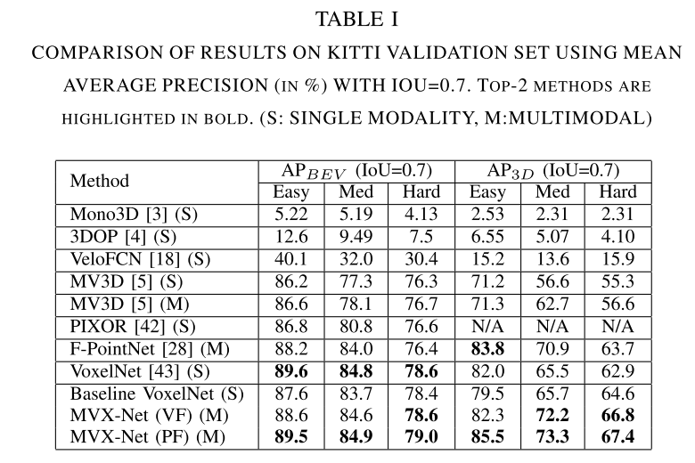
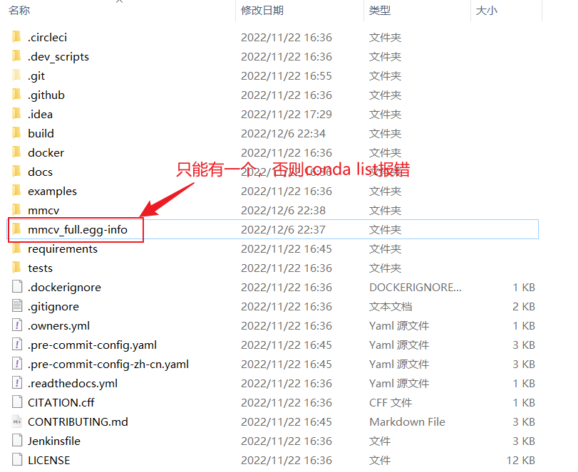

# OpenMMLab

## 架构


# MMCV

## 基础介绍

- 底层库，提供以下功能


- 安装

```shell
pip install -U openmim
mim install mmcv-full
```

## 主要模块

### 配置-config

`Config` 类用于操作配置文件，它支持从多种文件格式中加载配置，包括 **python**, **json** 和 **yaml**。 

### 注册器-registry

MMCV 使用 [注册器](https://github.com/open-mmlab/mmcv/blob/master/mmcv/utils/registry.py) 来管理具有相似功能的不同模块, 例如, 检测器中的主干网络、头部、和模型颈部。 在 OpenMMLab 家族中的绝大部分开源项目使用注册器去管理数据集和模型的模块，例如 [MMDetection](https://github.com/open-mmlab/mmdetection), [MMDetection3D](https://github.com/open-mmlab/mmdetection3d), [MMClassification](https://github.com/open-mmlab/mmclassification), [MMEditing](https://github.com/open-mmlab/mmediting) 等。


- 什么是注册器？

在MMCV中，注册器可以看作类或函数到字符串的映射。 一个注册器中的类或函数通常有相似的接口，但是可以实现不同的算法或支持不同的数据集。 借助注册器，用户可以通过使用相应的字符串查找类或函数，并根据他们的需要实例化对应模块或调用函数获取结果。 一个典型的案例是，OpenMMLab　中的大部分开源项目的配置系统，这些系统通过配置文件来使用注册器创建钩子、执行器、模型和数据集。

- 使用 `registry`（注册器）管理代码库中的模型，需要以下三个步骤。

1. 【builder】创建一个构建方法（可选，在大多数情况下您可以只使用默认方法）
2. 创建注册器
3. 使用此注册器来管理模块

### 执行器-runner

执行器模块负责模型训练过程调度，主要目的是让用户使用更少的代码以及灵活可配置方式开启训练。

### 文件输入输出-file io

### 数据处理-data process

### 可视化-visualization

### 卷积神经网络-cnn

我们为卷积神经网络提供了一些构建模块，包括层构建、模块组件和权重初始化。

### 算子-ops

### 辅助函数-utils

进度条track_progress、计时器Timer


# mmdetection

## Windows安装问题

- 库网络下载问题

```shell
# 问题描述
pip._vendor.urllib3.exceptions.ReadTimeoutError: HTTPSConnectionPool(host='files.pythonhosted.org', port=443): Read timed out.

# 解决：设置镜像源
pip install -v -e . -i https://pypi.tuna.tsinghua.edu.cn/simple 
```

- 源码版本回退

```shell
git checkout v2.24.0
```


## 流程抽象


## 核心组件


## 代码调试

### RetinaNet


### FPN

### anchor

anchor生成：
大的特征图预测小的物体，小的特征图预测大的物体，fpn有5个输出，所以会有5种尺度的anchor，每种尺度又分为9中宽高比。

anchor编码：

在 anchor-based 算法中，为了利用 anchor 信息进行更快更好的收敛，一般会对 head 输出的 bbox 分支 4 个值进行编解码操作，作用有两个。

1. 更好的平衡分类和回归分支 loss，以及平衡 bbox 四个预测值的 loss
2. 训练过程中引入 anchor 信息，加快收敛

首先gt box转化成中心点和宽高的形式，

同理anchor也转换成中心点和宽高的形式，

计算二者的相对值。

anchor分配：

这部分主要是根据iou的大小划分正负样本，既挑出那些负责预测gt的anchor。分配的策略非常简单，就是iou策略。

```shell
1. 正样本：和gt的iou大于0.5的ancho样本
2. 负样本：和gt的iou小于0.4的anchor
3. 忽略样本：其他anchor
```

## 数据集

 Pascal VOC， CityScapes, LVIS

### COCO

【2014】

MC COCO2017年主要包含以下四个任务：目标检测与分割、图像描述、人体关键点检测

【2017】COCO数据集现在有3种标注类型：**object instances（目标实例）, object keypoints（目标上的关键点）, 和image captions（看图说话）**。

```shell
annotations: 对应标注文件夹
	├── instances_train2017.json		: 对应目标检测、分割任务的
	├── instances_val2017.json			: 对应目标检测、分割任务的验证集标注文件
	├── captions_train2017.json			: 对应图像描述的训练集标注文件
	├── captions_val2017.json			: 对应图像描述的验证集标注文件
	├── person_keypoints_train2017.json	: 对应人体关键点检测的训练集标注文件
	└── person_keypoints_val2017.json	: 对应人体关键点检测的验证集标注文件夹


Object segmentation			  : 目标级分割
Recognition in context		  : 图像情景识别
Superpixel stuff segmentation : 超像素分割
330K images (>200K labeled)	  : 超过33万张图像，标注过的图像超过20万张
1.5 million object instances  : 150万个对象实例
80 object categories		  : 80个目标类别
91 stuff categories			  : 91个材料类别
5 captions per image		  : 每张图像有5段情景描述
250,000 people with keypoints : 对25万个人进行了关键点标注


""" 注意 """
COCO数据集格式中，bbox 的保存格式为 [x, y, w, h]  
如果需要转换为[x1,y1,x2,y2]，可以通过如下进行转换
bbox = [x1, y1, x1 + w - 1, y1 + h - 1]
```

- 以目标检测分割任务为例

```shell
annotation{
    "id": int, # 对象ID，因为每一个图像有不止一个对象，所以要对每一个对象编号（每个对象的ID是唯一的）
    "image_id": int,# 对应的图片ID（与images中的ID对应）
    "category_id": int,# 类别ID（与categories中的ID对应）
    "segmentation": RLE or [polygon],# 对象的边界点（边界多边形，此时iscrowd=0）。
    #segmentation格式取决于这个实例是一个单个的对象（即iscrowd=0，将使用polygons格式）还是一组对象（即iscrowd=1，将使用RLE格式）
    "area": float,# 区域面积
    "bbox": [x,y,width,height], # 定位边框 [x,y,w,h]
    "iscrowd": 0 or 1 #见下
}

```


# 配置文件详解

## 配置文件名称风格

```shell
{model}_[model setting]_{backbone}_{neck}_[norm setting]_[misc]_[gpu x batch_per_gpu]_{schedule}_{dataset}

{xxx} 是被要求填写的字段而 [yyy] 是可选的。

{model}：模型种类，例如 hv_pointpillars (Hard Voxelization PointPillars)、VoteNet 等。
[model setting]：某些模型的特殊设定。
{backbone}： 主干网络种类例如 regnet-400mf、regnet-1.6gf 等。
{neck}：模型颈部的种类包括 fpn、secfpn 等。
[norm_setting]：如无特殊声明，默认使用 bn (Batch Normalization)，其他类型可以有 gn (Group Normalization)、sbn (Synchronized Batch Normalization) 等。 gn-head/gn-neck 表示 GN 仅应用于网络的头部或颈部，而 gn-all 表示 GN 用于整个模型，例如主干网络、颈部和头部。
[misc]：模型中各式各样的设置/插件，例如 strong-aug 意味着在训练过程中使用更强的数据增广策略。
[batch_per_gpu x gpu]：每个 GPU 的样本数和 GPU 数量，默认使用 4x8。
{schedule}：训练方案，选项是 1x、2x、20e 等。 1x 和 2x 分别代表训练 12 和 24 轮。 20e 在级联模型中使用，表示训练 20 轮。 对于 1x/2x，初始学习率在第 8/16 和第 11/22 轮衰减 10 倍；对于 20e，初始学习率在第 16 和第 19 轮衰减 10 倍。
{dataset}：数据集，例如 nus-3d、kitti-3d、lyft-3d、scannet-3d、sunrgbd-3d 等。 当某一数据集存在多种设定时，我们也标记下所使用的类别数量，例如 kitti-3d-3class 和 kitti-3d-car 分别意味着在 KITTI 的所有三类上和单独车这一类上进行训练。
```

## faster_rcnn_r50_fpn_1x.py配置文件

```shell
# model settings
model = dict(
	type='FasterRCNN',                         # model类型
    pretrained='modelzoo://resnet50',          # 预训练模型：imagenet-resnet50
    backbone=dict(
        type='ResNet',                         # backbone类型
        depth=50,                              # 网络层数
        num_stages=4,                          # resnet的stage数量
        out_indices=(0, 1, 2, 3),              # 输出的stage的序号
        frozen_stages=1,                       # 冻结的stage数量，即该stage不更新参数，-1表示所有的stage都更新参数
        style='pytorch'),                      # 网络风格：如果设置pytorch，则stride为2的层是conv3x3的卷积层；如果设置caffe，则stride为2的层是第一个conv1x1的卷积层
    neck=dict(
        type='FPN',                            # neck类型
        in_channels=[256, 512, 1024, 2048],    # 输入的各个stage的通道数
        out_channels=256,                      # 输出的特征层的通道数
        num_outs=5),                           # 输出的特征层的数量
    rpn_head=dict(
        type='RPNHead',                        # RPN网络类型
        in_channels=256,                       # RPN网络的输入通道数
        feat_channels=256,                     # 特征层的通道数
        anchor_scales=[8],                     # 生成的anchor的baselen，baselen = sqrt(w*h)，w和h为anchor的宽和高
        anchor_ratios=[0.5, 1.0, 2.0],         # anchor的宽高比
        anchor_strides=[4, 8, 16, 32, 64],     # 在每个特征层上的anchor的步长（对应于原图）
        target_means=[.0, .0, .0, .0],         # 均值
        target_stds=[1.0, 1.0, 1.0, 1.0],      # 方差
        use_sigmoid_cls=True),                 # 是否使用sigmoid来进行分类，如果False则使用softmax来分类
    bbox_roi_extractor=dict(
        type='SingleRoIExtractor',                                   # RoIExtractor类型
        roi_layer=dict(type='RoIAlign', out_size=7, sample_num=2),   # ROI具体参数：ROI类型为ROIalign，输出尺寸为7，sample数为2
        out_channels=256,                                            # 输出通道数
        featmap_strides=[4, 8, 16, 32]),                             # 特征图的步长
    bbox_head=dict(
        type='SharedFCBBoxHead',                     # 全连接层类型
        num_fcs=2,                                   # 全连接层数量
        in_channels=256,                             # 输入通道数
        fc_out_channels=1024,                        # 输出通道数
        roi_feat_size=7,                             # ROI特征层尺寸
        num_classes=81,                              # 分类器的类别数量+1，+1是因为多了一个背景的类别
        target_means=[0., 0., 0., 0.],               # 均值
        target_stds=[0.1, 0.1, 0.2, 0.2],            # 方差
        reg_class_agnostic=False))                   # 是否采用class_agnostic的方式来预测，class_agnostic表示输出bbox时只考虑其是否为前景，后续分类的时候再根据该bbox在网络中的类别得分来分类，也就是说一个框可以对应多个类别
# model training and testing settings
train_cfg = dict(
    rpn=dict(
        assigner=dict(
            type='MaxIoUAssigner',            # RPN网络的正负样本划分
            pos_iou_thr=0.7,                  # 正样本的iou阈值
            neg_iou_thr=0.3,                  # 负样本的iou阈值
            min_pos_iou=0.3,                  # 正样本的iou最小值。如果assign给ground truth的anchors中最大的IOU低于0.3，则忽略所有的anchors，否则保留最大IOU的anchor
            ignore_iof_thr=-1),               # 忽略bbox的阈值，当ground truth中包含需要忽略的bbox时使用，-1表示不忽略
        sampler=dict(
            type='RandomSampler',             # 正负样本提取器类型
            num=256,                          # 需提取的正负样本数量
            pos_fraction=0.5,                 # 正样本比例
            neg_pos_ub=-1,                    # 最大负样本比例，大于该比例的负样本忽略，-1表示不忽略
            add_gt_as_proposals=False),       # 把ground truth加入proposal作为正样本
        allowed_border=0,                     # 允许在bbox周围外扩一定的像素
        pos_weight=-1,                        # 正样本权重，-1表示不改变原始的权重
        smoothl1_beta=1 / 9.0,                # 平滑L1系数
        debug=False),                         # debug模式
    rcnn=dict(
        assigner=dict(
            type='MaxIoUAssigner',            # RCNN网络正负样本划分
            pos_iou_thr=0.5,                  # 正样本的iou阈值
            neg_iou_thr=0.5,                  # 负样本的iou阈值
            min_pos_iou=0.5,                  # 正样本的iou最小值。如果assign给ground truth的anchors中最大的IOU低于0.3，则忽略所有的anchors，否则保留最大IOU的anchor
            ignore_iof_thr=-1),               # 忽略bbox的阈值，当ground truth中包含需要忽略的bbox时使用，-1表示不忽略
        sampler=dict(
            type='RandomSampler',             # 正负样本提取器类型
            num=512,                          # 需提取的正负样本数量
            pos_fraction=0.25,                # 正样本比例
            neg_pos_ub=-1,                    # 最大负样本比例，大于该比例的负样本忽略，-1表示不忽略
            add_gt_as_proposals=True),        # 把ground truth加入proposal作为正样本
        pos_weight=-1,                        # 正样本权重，-1表示不改变原始的权重
        debug=False))                         # debug模式
test_cfg = dict(
    rpn=dict(                                 # 推断时的RPN参数
        nms_across_levels=False,              # 在所有的fpn层内做nms
        nms_pre=2000,                         # 在nms之前保留的的得分最高的proposal数量
        nms_post=2000,                        # 在nms之后保留的的得分最高的proposal数量
        max_num=2000,                         # 在后处理完成之后保留的proposal数量
        nms_thr=0.7,                          # nms阈值
        min_bbox_size=0),                     # 最小bbox尺寸
    rcnn=dict(
        score_thr=0.05, nms=dict(type='nms', iou_thr=0.5), max_per_img=100)   # max_per_img表示最终输出的det bbox数量
    # soft-nms is also supported for rcnn testing
    # e.g., nms=dict(type='soft_nms', iou_thr=0.5, min_score=0.05)            # soft_nms参数
)
# dataset settings
dataset_type = 'CocoDataset'                # 数据集类型
data_root = 'data/coco/'                    # 数据集根目录
img_norm_cfg = dict(
    mean=[123.675, 116.28, 103.53], std=[58.395, 57.12, 57.375], to_rgb=True)   # 输入图像初始化，减去均值mean并处以方差std，to_rgb表示将bgr转为rgb
data = dict(
    imgs_per_gpu=2,                # 每个gpu计算的图像数量
    workers_per_gpu=2,             # 每个gpu分配的线程数
    train=dict(
        type=dataset_type,                                                 # 数据集类型
        ann_file=data_root + 'annotations/instances_train2017.json',       # 数据集annotation路径
        img_prefix=data_root + 'train2017/',                               # 数据集的图片路径
        img_scale=(1333, 800),                                             # 输入图像尺寸，最大边1333，最小边800
        img_norm_cfg=img_norm_cfg,                                         # 图像初始化参数
        size_divisor=32,                                                   # 对图像进行resize时的最小单位，32表示所有的图像都会被resize成32的倍数
        flip_ratio=0.5,                                                    # 图像的随机左右翻转的概率
        with_mask=False,                                                   # 训练时附带mask
        with_crowd=True,                                                   # 训练时附带difficult的样本
        with_label=True),                                                  # 训练时附带label
    val=dict(
        type=dataset_type,                                                 # 同上
        ann_file=data_root + 'annotations/instances_val2017.json',         # 同上
        img_prefix=data_root + 'val2017/',                                 # 同上
        img_scale=(1333, 800),                                             # 同上
        img_norm_cfg=img_norm_cfg,                                         # 同上
        size_divisor=32,                                                   # 同上
        flip_ratio=0,                                                      # 同上
        with_mask=False,                                                   # 同上
        with_crowd=True,                                                   # 同上
        with_label=True),                                                  # 同上
    test=dict(
        type=dataset_type,                                                 # 同上
        ann_file=data_root + 'annotations/instances_val2017.json',         # 同上
        img_prefix=data_root + 'val2017/',                                 # 同上
        img_scale=(1333, 800),                                             # 同上
        img_norm_cfg=img_norm_cfg,                                         # 同上
        size_divisor=32,                                                   # 同上
        flip_ratio=0,                                                      # 同上
        with_mask=False,                                                   # 同上
        with_label=False,                                                  # 同上
        test_mode=True))                                                   # 同上
# optimizer
optimizer = dict(type='SGD', lr=0.02, momentum=0.9, weight_decay=0.0001)   # 优化参数，lr为学习率，momentum为动量因子，weight_decay为权重衰减因子
optimizer_config = dict(grad_clip=dict(max_norm=35, norm_type=2))          # 梯度均衡参数
# learning policy
lr_config = dict(
    policy='step',                        # 优化策略
    warmup='linear',                      # 初始的学习率增加的策略，linear为线性增加
    warmup_iters=500,                     # 在初始的500次迭代中学习率逐渐增加
    warmup_ratio=1.0 / 3,                 # 起始的学习率
    step=[8, 11])                         # 在第8和11个epoch时降低学习率
checkpoint_config = dict(interval=1)      # 每1个epoch存储一次模型
# yapf:disable
log_config = dict(
    interval=50,                          # 每50个batch输出一次信息
    hooks=[
        dict(type='TextLoggerHook'),      # 控制台输出信息的风格
        # dict(type='TensorboardLoggerHook')
    ])
# yapf:enable
# runtime settings
total_epochs = 12                               # 最大epoch数
dist_params = dict(backend='nccl')              # 分布式参数
log_level = 'INFO'                              # 输出信息的完整度级别
work_dir = './work_dirs/faster_rcnn_r50_fpn_1x' # log文件和模型文件存储路径
load_from = None                                # 加载模型的路径，None表示从预训练模型加载
resume_from = None                              # 恢复训练模型的路径
workflow = [('train', 1)]                       # 当前工作区名称
```

## cascade_rcnn_r50_fpn_1x.py配置文件

```shell
# model settings
model = dict(
    type='CascadeRCNN',
    num_stages=3,                     # RCNN网络的stage数量，在faster-RCNN中为1
    pretrained='modelzoo://resnet50',
    backbone=dict(
        type='ResNet',
        depth=50,
        num_stages=4,
        out_indices=(0, 1, 2, 3),
        frozen_stages=1,
        style='pytorch'),
    neck=dict(
        type='FPN',
        in_channels=[256, 512, 1024, 2048],
        out_channels=256,
        num_outs=5),
    rpn_head=dict(
        type='RPNHead',
        in_channels=256,
        feat_channels=256,
        anchor_scales=[8],
        anchor_ratios=[0.5, 1.0, 2.0],
        anchor_strides=[4, 8, 16, 32, 64],
        target_means=[.0, .0, .0, .0],
        target_stds=[1.0, 1.0, 1.0, 1.0],
        use_sigmoid_cls=True),
    bbox_roi_extractor=dict(
        type='SingleRoIExtractor',
        roi_layer=dict(type='RoIAlign', out_size=7, sample_num=2),
        out_channels=256,
        featmap_strides=[4, 8, 16, 32]),
    bbox_head=[
        dict(
            type='SharedFCBBoxHead',
            num_fcs=2,
            in_channels=256,
            fc_out_channels=1024,
            roi_feat_size=7,
            num_classes=81,
            target_means=[0., 0., 0., 0.],
            target_stds=[0.1, 0.1, 0.2, 0.2],
            reg_class_agnostic=True),
        dict(
            type='SharedFCBBoxHead',
            num_fcs=2,
            in_channels=256,
            fc_out_channels=1024,
            roi_feat_size=7,
            num_classes=81,
            target_means=[0., 0., 0., 0.],
            target_stds=[0.05, 0.05, 0.1, 0.1],
            reg_class_agnostic=True),
        dict(
            type='SharedFCBBoxHead',
            num_fcs=2,
            in_channels=256,
            fc_out_channels=1024,
            roi_feat_size=7,
            num_classes=81,
            target_means=[0., 0., 0., 0.],
            target_stds=[0.033, 0.033, 0.067, 0.067],
            reg_class_agnostic=True)
    ])
# model training and testing settings
train_cfg = dict(
    rpn=dict(
        assigner=dict(
            type='MaxIoUAssigner',
            pos_iou_thr=0.7,
            neg_iou_thr=0.3,
            min_pos_iou=0.3,
            ignore_iof_thr=-1),
        sampler=dict(
            type='RandomSampler',
            num=256,
            pos_fraction=0.5,
            neg_pos_ub=-1,
            add_gt_as_proposals=False),
        allowed_border=0,
        pos_weight=-1,
        smoothl1_beta=1 / 9.0,
        debug=False),
    rcnn=[                    # 注意，这里有3个RCNN的模块，对应开头的那个RCNN的stage数量
        dict(
            assigner=dict(
                type='MaxIoUAssigner',
                pos_iou_thr=0.5,
                neg_iou_thr=0.5,
                min_pos_iou=0.5,
                ignore_iof_thr=-1),
            sampler=dict(
                type='RandomSampler',
                num=512,
                pos_fraction=0.25,
                neg_pos_ub=-1,
                add_gt_as_proposals=True),
            pos_weight=-1,
            debug=False),
        dict(
            assigner=dict(
                type='MaxIoUAssigner',
                pos_iou_thr=0.6,
                neg_iou_thr=0.6,
                min_pos_iou=0.6,
                ignore_iof_thr=-1),
            sampler=dict(
                type='RandomSampler',
                num=512,
                pos_fraction=0.25,
                neg_pos_ub=-1,
                add_gt_as_proposals=True),
            pos_weight=-1,
            debug=False),
        dict(
            assigner=dict(
                type='MaxIoUAssigner',
                pos_iou_thr=0.7,
                neg_iou_thr=0.7,
                min_pos_iou=0.7,
                ignore_iof_thr=-1),
            sampler=dict(
                type='RandomSampler',
                num=512,
                pos_fraction=0.25,
                neg_pos_ub=-1,
                add_gt_as_proposals=True),
            pos_weight=-1,
            debug=False)
    ],
    stage_loss_weights=[1, 0.5, 0.25])     # 3个RCNN的stage的loss权重
test_cfg = dict(
    rpn=dict(
        nms_across_levels=False,
        nms_pre=2000,
        nms_post=2000,
        max_num=2000,
        nms_thr=0.7,
        min_bbox_size=0),
    rcnn=dict(
        score_thr=0.05, nms=dict(type='nms', iou_thr=0.5), max_per_img=100),
    keep_all_stages=False)         # 是否保留所有stage的结果
# dataset settings
dataset_type = 'CocoDataset'
data_root = 'data/coco/'
img_norm_cfg = dict(
    mean=[123.675, 116.28, 103.53], std=[58.395, 57.12, 57.375], to_rgb=True)
data = dict(
    imgs_per_gpu=2,
    workers_per_gpu=2,
    train=dict(
        type=dataset_type,
        ann_file=data_root + 'annotations/instances_train2017.json',
        img_prefix=data_root + 'train2017/',
        img_scale=(1333, 800),
        img_norm_cfg=img_norm_cfg,
        size_divisor=32,
        flip_ratio=0.5,
        with_mask=False,
        with_crowd=True,
        with_label=True),
    val=dict(
        type=dataset_type,
        ann_file=data_root + 'annotations/instances_val2017.json',
        img_prefix=data_root + 'val2017/',
        img_scale=(1333, 800),
        img_norm_cfg=img_norm_cfg,
        size_divisor=32,
        flip_ratio=0,
        with_mask=False,
        with_crowd=True,
        with_label=True),
    test=dict(
        type=dataset_type,
        ann_file=data_root + 'annotations/instances_val2017.json',
        img_prefix=data_root + 'val2017/',
        img_scale=(1333, 800),
        img_norm_cfg=img_norm_cfg,
        size_divisor=32,
        flip_ratio=0,
        with_mask=False,
        with_label=False,
        test_mode=True))
# optimizer
optimizer = dict(type='SGD', lr=0.02, momentum=0.9, weight_decay=0.0001)
optimizer_config = dict(grad_clip=dict(max_norm=35, norm_type=2))
# learning policy
lr_config = dict(
    policy='step',
    warmup='linear',
    warmup_iters=500,
    warmup_ratio=1.0 / 3,
    step=[8, 11])
checkpoint_config = dict(interval=1)
# yapf:disable
log_config = dict(
    interval=50,
    hooks=[
        dict(type='TextLoggerHook'),
        # dict(type='TensorboardLoggerHook')
    ])
# yapf:enable
# runtime settings
total_epochs = 12
dist_params = dict(backend='nccl')
log_level = 'INFO'
work_dir = './work_dirs/cascade_rcnn_r50_fpn_1x'
load_from = None
resume_from = None
workflow = [('train', 1)]
```

## VoteNet 配置文件示例

```shell
model = dict(
    type='VoteNet',  # 检测器的类型，更多细节请参考 mmdet3d.models.detectors
    backbone=dict(
        type='PointNet2SASSG',  # 主干网络的类型，更多细节请参考 mmdet3d.models.backbones
        in_channels=4,  # 点云输入通道数
        num_points=(2048, 1024, 512, 256),  # 每个 SA 模块采样的中心点的数量
        radius=(0.2, 0.4, 0.8, 1.2),  # 每个 SA 层的半径
        num_samples=(64, 32, 16, 16),  # 每个 SA 层聚集的点的数量
        sa_channels=((64, 64, 128), (128, 128, 256), (128, 128, 256),
                     (128, 128, 256)),  # SA 模块中每个多层感知器的输出通道数
        fp_channels=((256, 256), (256, 256)),  # FP 模块中每个多层感知器的输出通道数
        norm_cfg=dict(type='BN2d'),  # 归一化层的配置
        sa_cfg=dict(  # 点集抽象 (SA) 模块的配置
            type='PointSAModule',  # SA 模块的类型
            pool_mod='max',  # SA 模块的池化方法 (最大池化或平均池化)
            use_xyz=True,  # 在特征聚合中是否使用 xyz 坐标
            normalize_xyz=True)),  # 在特征聚合中是否使用标准化的 xyz 坐标
    bbox_head=dict(
        type='VoteHead',  # 检测框头的类型，更多细节请参考 mmdet3d.models.dense_heads
        num_classes=18,  # 分类的类别数量
        bbox_coder=dict(
            type='PartialBinBasedBBoxCoder',  # 框编码层的类型，更多细节请参考 mmdet3d.core.bbox.coders
            num_sizes=18,  # 尺寸聚类的数量
            num_dir_bins=1,   # 编码方向角的间隔数
            with_rot=False,  # 框是否带有旋转角度
            mean_sizes=[[0.76966727, 0.8116021, 0.92573744],
                        [1.876858, 1.8425595, 1.1931566],
                        [0.61328, 0.6148609, 0.7182701],
                        [1.3955007, 1.5121545, 0.83443564],
                        [0.97949594, 1.0675149, 0.6329687],
                        [0.531663, 0.5955577, 1.7500148],
                        [0.9624706, 0.72462326, 1.1481868],
                        [0.83221924, 1.0490936, 1.6875663],
                        [0.21132214, 0.4206159, 0.5372846],
                        [1.4440073, 1.8970833, 0.26985747],
                        [1.0294262, 1.4040797, 0.87554324],
                        [1.3766412, 0.65521795, 1.6813129],
                        [0.6650819, 0.71111923, 1.298853],
                        [0.41999173, 0.37906948, 1.7513971],
                        [0.59359556, 0.5912492, 0.73919016],
                        [0.50867593, 0.50656086, 0.30136237],
                        [1.1511526, 1.0546296, 0.49706793],
                        [0.47535285, 0.49249494, 0.5802117]]),  # 每一类的平均尺寸，其顺序与类名顺序相同
        vote_moudule_cfg=dict(  # 投票 (vote) 模块的配置，更多细节请参考 mmdet3d.models.model_utils
            in_channels=256,  # 投票模块的输入通道数
            vote_per_seed=1,  # 对于每个种子点生成的投票数
            gt_per_seed=3,  # 每个种子点的真实标签个数
            conv_channels=(256, 256),  # 卷积通道数
            conv_cfg=dict(type='Conv1d'),  # 卷积配置
            norm_cfg=dict(type='BN1d'),  # 归一化层配置
            norm_feats=True,  # 是否标准化特征
            vote_loss=dict(  # 投票分支的损失函数配置
                type='ChamferDistance',  # 投票分支的损失函数类型
                mode='l1',  # 投票分支的损失函数模式
                reduction='none',  # 设置对损失函数输出的聚合方法
                loss_dst_weight=10.0)),  # 投票分支的目标损失权重
        vote_aggregation_cfg=dict(  # 投票聚合分支的配置
            type='PointSAModule',  # 投票聚合模块的类型
            num_point=256,  # 投票聚合分支中 SA 模块的点的数量
            radius=0.3,  # 投票聚合分支中 SA 模块的半径
            num_sample=16,  # 投票聚合分支中 SA 模块的采样点的数量
            mlp_channels=[256, 128, 128, 128],  # 投票聚合分支中 SA 模块的多层感知器的通道数
            use_xyz=True,  # 是否使用 xyz 坐标
            normalize_xyz=True),  # 是否使用标准化后的 xyz 坐标
        feat_channels=(128, 128),  # 特征卷积的通道数
        conv_cfg=dict(type='Conv1d'),  # 卷积的配置
        norm_cfg=dict(type='BN1d'),  # 归一化层的配置
        objectness_loss=dict(  # 物体性 (objectness) 损失函数的配置
            type='CrossEntropyLoss',  # 损失函数类型
            class_weight=[0.2, 0.8],  # 损失函数对每一类的权重
            reduction='sum',  # 设置损失函数输出的聚合方法
            loss_weight=5.0),  # 损失函数权重
        center_loss=dict(  # 中心 (center) 损失函数的配置
            type='ChamferDistance',  # 损失函数类型
            mode='l2',  # 损失函数模式
            reduction='sum',  # 设置损失函数输出的聚合方法
            loss_src_weight=10.0,  # 源损失权重
            loss_dst_weight=10.0),  # 目标损失权重
        dir_class_loss=dict(  # 方向分类损失函数的配置
            type='CrossEntropyLoss',  # 损失函数类型
            reduction='sum',  # 设置损失函数输出的聚合方法
            loss_weight=1.0),  # 损失函数权重
        dir_res_loss=dict(  # 方向残差 (residual) 损失函数的配置
            type='SmoothL1Loss',  # 损失函数类型
            reduction='sum',  # 设置损失函数输出的聚合方法
            loss_weight=10.0),  # 损失函数权重
        size_class_loss=dict(  # 尺寸分类损失函数的配置
            type='CrossEntropyLoss',  # 损失函数类型
            reduction='sum',  # 设置损失函数输出的聚合方法
            loss_weight=1.0),  # 损失函数权重
        size_res_loss=dict(  # 尺寸残差损失函数的配置
            type='SmoothL1Loss',  # 损失函数类型
            reduction='sum',  # 设置损失函数输出的聚合方法
            loss_weight=3.3333333333333335),  # 损失函数权重
        semantic_loss=dict(  # 语义损失函数的配置
            type='CrossEntropyLoss',  # 损失函数类型
            reduction='sum',  # 设置损失函数输出的聚合方法
            loss_weight=1.0)),  # 损失函数权重
    train_cfg = dict(  # VoteNet 训练的超参数配置
        pos_distance_thr=0.3,  # 距离 >= 0.3 阈值的样本将被视为正样本
        neg_distance_thr=0.6,  # 距离 < 0.6 阈值的样本将被视为负样本
        sample_mod='vote'),  # 采样方法的模式
    test_cfg = dict(  # VoteNet 测试的超参数配置
        sample_mod='seed',  # 采样方法的模式
        nms_thr=0.25,  # NMS 中使用的阈值
        score_thr=0.8,  # 剔除框的阈值
        per_class_proposal=False))  # 是否使用逐类提议框 (proposal)
dataset_type = 'ScanNetDataset'  # 数据集类型
data_root = './data/scannet/'  # 数据路径
class_names = ('cabinet', 'bed', 'chair', 'sofa', 'table', 'door', 'window',
               'bookshelf', 'picture', 'counter', 'desk', 'curtain',
               'refrigerator', 'showercurtrain', 'toilet', 'sink', 'bathtub',
               'garbagebin')  # 类的名称
train_pipeline = [  # 训练流水线，更多细节请参考 mmdet3d.datasets.pipelines
    dict(
        type='LoadPointsFromFile',  # 第一个流程，用于读取点，更多细节请参考 mmdet3d.datasets.pipelines.indoor_loading
        shift_height=True,  # 是否使用变换高度
        load_dim=6,  # 读取的点的维度
        use_dim=[0, 1, 2]),  # 使用所读取点的哪些维度
    dict(
        type='LoadAnnotations3D',  # 第二个流程，用于读取标注，更多细节请参考 mmdet3d.datasets.pipelines.indoor_loading
        with_bbox_3d=True,  # 是否读取 3D 框
        with_label_3d=True,  # 是否读取 3D 框对应的类别标签
        with_mask_3d=True,  # 是否读取 3D 实例分割掩码
        with_seg_3d=True),  # 是否读取 3D 语义分割掩码
    dict(
        type='PointSegClassMapping',  # 选取有效的类别，更多细节请参考 mmdet3d.datasets.pipelines.point_seg_class_mapping
        valid_cat_ids=(3, 4, 5, 6, 7, 8, 9, 10, 11, 12, 14, 16, 24, 28, 33, 34,
                       36, 39),  # 所有有效类别的编号
        max_cat_id=40),  # 输入语义分割掩码中可能存在的最大类别编号
    dict(type='PointSample',  # 室内点采样，更多细节请参考 mmdet3d.datasets.pipelines.indoor_sample
            num_points=40000),  # 采样的点的数量
    dict(type='IndoorFlipData',  # 数据增广流程，随机翻转点和 3D 框
        flip_ratio_yz=0.5,  # 沿着 yz 平面被翻转的概率
        flip_ratio_xz=0.5),  # 沿着 xz 平面被翻转的概率
    dict(
        type='IndoorGlobalRotScale',  # 数据增广流程，旋转并放缩点和 3D 框，更多细节请参考 mmdet3d.datasets.pipelines.indoor_augment
        shift_height=True,  # 读取的点是否有高度这一属性
        rot_range=[-0.027777777777777776, 0.027777777777777776],  # 旋转角范围
        scale_range=None),  # 缩放尺寸范围
    dict(
        type='DefaultFormatBundle3D',  # 默认格式打包以收集读取的所有数据，更多细节请参考 mmdet3d.datasets.pipelines.formatting
        class_names=('cabinet', 'bed', 'chair', 'sofa', 'table', 'door',
                     'window', 'bookshelf', 'picture', 'counter', 'desk',
                     'curtain', 'refrigerator', 'showercurtrain', 'toilet',
                     'sink', 'bathtub', 'garbagebin')),
    dict(
        type='Collect3D',  # 最后一个流程，决定哪些键值对应的数据会被输入给检测器，更多细节请参考 mmdet3d.datasets.pipelines.formatting
        keys=[
            'points', 'gt_bboxes_3d', 'gt_labels_3d', 'pts_semantic_mask',
            'pts_instance_mask'
        ])
]
test_pipeline = [  # 测试流水线，更多细节请参考 mmdet3d.datasets.pipelines
    dict(
        type='LoadPointsFromFile',  # 第一个流程，用于读取点，更多细节请参考 mmdet3d.datasets.pipelines.indoor_loading
        shift_height=True,  # 是否使用变换高度
        load_dim=6,  # 读取的点的维度
        use_dim=[0, 1, 2]),  # 使用所读取点的哪些维度
    dict(type='PointSample',  # 室内点采样，更多细节请参考 mmdet3d.datasets.pipelines.indoor_sample
            num_points=40000),  # 采样的点的数量
    dict(
        type='DefaultFormatBundle3D',  # 默认格式打包以收集读取的所有数据，更多细节请参考 mmdet3d.datasets.pipelines.formatting
        class_names=('cabinet', 'bed', 'chair', 'sofa', 'table', 'door',
                     'window', 'bookshelf', 'picture', 'counter', 'desk',
                     'curtain', 'refrigerator', 'showercurtrain', 'toilet',
                     'sink', 'bathtub', 'garbagebin')),
    dict(type='Collect3D',  # 最后一个流程，决定哪些键值对应的数据会被输入给检测器，更多细节请参考 mmdet3d.datasets.pipelines.formatting
        keys=['points'])
]
eval_pipeline = [  # 模型验证或可视化所使用的流水线，更多细节请参考 mmdet3d.datasets.pipelines
    dict(
        type='LoadPointsFromFile',  # 第一个流程，用于读取点，更多细节请参考 mmdet3d.datasets.pipelines.indoor_loading
        shift_height=True,  # 是否使用变换高度
        load_dim=6,  # 读取的点的维度
        use_dim=[0, 1, 2]),  # 使用所读取点的哪些维度
    dict(
        type='DefaultFormatBundle3D',  # 默认格式打包以收集读取的所有数据，更多细节请参考 mmdet3d.datasets.pipelines.formatting
        class_names=('cabinet', 'bed', 'chair', 'sofa', 'table', 'door',
                     'window', 'bookshelf', 'picture', 'counter', 'desk',
                     'curtain', 'refrigerator', 'showercurtrain', 'toilet',
                     'sink', 'bathtub', 'garbagebin')),
        with_label=False),
    dict(type='Collect3D',  # 最后一个流程，决定哪些键值对应的数据会被输入给检测器，更多细节请参考 mmdet3d.datasets.pipelines.formatting
        keys=['points'])
]
data = dict(
    samples_per_gpu=8,  # 单张 GPU 上的样本数
    workers_per_gpu=4,  # 每张 GPU 上用于读取数据的进程数
    train=dict(  # 训练数据集配置
        type='RepeatDataset',  # 数据集嵌套，更多细节请参考 https://github.com/open-mmlab/mmdetection/blob/master/mmdet/datasets/dataset_wrappers.py
        times=5,  # 重复次数
        dataset=dict(
            type='ScanNetDataset',  # 数据集类型
            data_root='./data/scannet/',  # 数据路径
            ann_file='./data/scannet/scannet_infos_train.pkl',  # 数据标注文件的路径
            pipeline=[  # 流水线，这里传入的就是上面创建的训练流水线变量
                dict(
                    type='LoadPointsFromFile',
                    shift_height=True,
                    load_dim=6,
                    use_dim=[0, 1, 2]),
                dict(
                    type='LoadAnnotations3D',
                    with_bbox_3d=True,
                    with_label_3d=True,
                    with_mask_3d=True,
                    with_seg_3d=True),
                dict(
                    type='PointSegClassMapping',
                    valid_cat_ids=(3, 4, 5, 6, 7, 8, 9, 10, 11, 12, 14, 16, 24,
                                   28, 33, 34, 36, 39),
                    max_cat_id=40),
                dict(type='PointSample', num_points=40000),
                dict(
                    type='IndoorFlipData',
                    flip_ratio_yz=0.5,
                    flip_ratio_xz=0.5),
                dict(
                    type='IndoorGlobalRotScale',
                    shift_height=True,
                    rot_range=[-0.027777777777777776, 0.027777777777777776],
                    scale_range=None),
                dict(
                    type='DefaultFormatBundle3D',
                    class_names=('cabinet', 'bed', 'chair', 'sofa', 'table',
                                 'door', 'window', 'bookshelf', 'picture',
                                 'counter', 'desk', 'curtain', 'refrigerator',
                                 'showercurtrain', 'toilet', 'sink', 'bathtub',
                                 'garbagebin')),
                dict(
                    type='Collect3D',
                    keys=[
                        'points', 'gt_bboxes_3d', 'gt_labels_3d',
                        'pts_semantic_mask', 'pts_instance_mask'
                    ])
            ],
            filter_empty_gt=False,  # 是否过滤掉空的标签框
            classes=('cabinet', 'bed', 'chair', 'sofa', 'table', 'door',
                     'window', 'bookshelf', 'picture', 'counter', 'desk',
                     'curtain', 'refrigerator', 'showercurtrain', 'toilet',
                     'sink', 'bathtub', 'garbagebin'))),  # 类别名称
    val=dict(  # 验证数据集配置
        type='ScanNetDataset',  # 数据集类型
        data_root='./data/scannet/',  # 数据路径
        ann_file='./data/scannet/scannet_infos_val.pkl',  # 数据标注文件的路径
        pipeline=[  # 流水线，这里传入的就是上面创建的测试流水线变量
            dict(
                type='LoadPointsFromFile',
                shift_height=True,
                load_dim=6,
                use_dim=[0, 1, 2]),
            dict(type='PointSample', num_points=40000),
            dict(
                type='DefaultFormatBundle3D',
                class_names=('cabinet', 'bed', 'chair', 'sofa', 'table',
                             'door', 'window', 'bookshelf', 'picture',
                             'counter', 'desk', 'curtain', 'refrigerator',
                             'showercurtrain', 'toilet', 'sink', 'bathtub',
                             'garbagebin')),
            dict(type='Collect3D', keys=['points'])
        ],
        classes=('cabinet', 'bed', 'chair', 'sofa', 'table', 'door', 'window',
                 'bookshelf', 'picture', 'counter', 'desk', 'curtain',
                 'refrigerator', 'showercurtrain', 'toilet', 'sink', 'bathtub',
                 'garbagebin'),  # 类别名称
        test_mode=True),  # 是否开启测试模式
    test=dict(  # 测试数据集配置
        type='ScanNetDataset',  # 数据集类型
        data_root='./data/scannet/',  # 数据路径
        ann_file='./data/scannet/scannet_infos_val.pkl',  # 数据标注文件的路径
        pipeline=[  # 流水线，这里传入的就是上面创建的测试流水线变量
            dict(
                type='LoadPointsFromFile',
                shift_height=True,
                load_dim=6,
                use_dim=[0, 1, 2]),
            dict(type='PointSample', num_points=40000),
            dict(
                type='DefaultFormatBundle3D',
                class_names=('cabinet', 'bed', 'chair', 'sofa', 'table',
                             'door', 'window', 'bookshelf', 'picture',
                             'counter', 'desk', 'curtain', 'refrigerator',
                             'showercurtrain', 'toilet', 'sink', 'bathtub',
                             'garbagebin')),
            dict(type='Collect3D', keys=['points'])
        ],
        classes=('cabinet', 'bed', 'chair', 'sofa', 'table', 'door', 'window',
                 'bookshelf', 'picture', 'counter', 'desk', 'curtain',
                 'refrigerator', 'showercurtrain', 'toilet', 'sink', 'bathtub',
                 'garbagebin'),  # 类别名称
        test_mode=True))  # 是否开启测试模式
evaluation = dict(pipeline=[  # 流水线，这里传入的就是上面创建的验证流水线变量
    dict(
        type='LoadPointsFromFile',
        coord_type='DEPTH',
        shift_height=False,
        load_dim=6,
        use_dim=[0, 1, 2]),
    dict(
        type='DefaultFormatBundle3D',
        class_names=('cabinet', 'bed', 'chair', 'sofa', 'table', 'door',
                     'window', 'bookshelf', 'picture', 'counter', 'desk',
                     'curtain', 'refrigerator', 'showercurtrain', 'toilet',
                     'sink', 'bathtub', 'garbagebin'),
        with_label=False),
    dict(type='Collect3D', keys=['points'])
])
lr = 0.008  # 优化器的学习率
optimizer = dict(  # 构建优化器所使用的配置，我们支持所有 PyTorch 中支持的优化器，并且拥有相同的参数名称
    type='Adam',  # 优化器类型，更多细节请参考 https://github.com/open-mmlab/mmcv/blob/v1.3.7/mmcv/runner/optimizer/default_constructor.py#L12
    lr=0.008)  # 优化器的学习率，用户可以在 PyTorch 文档中查看这些参数的详细使用方法
optimizer_config = dict(  # 构建优化器钩子的配置，更多实现细节可参考 https://github.com/open-mmlab/mmcv/blob/v1.3.7/mmcv/runner/hooks/optimizer.py#L22
    grad_clip=dict(  # 梯度裁剪的配置
    max_norm=10,  # 梯度的最大模长
    norm_type=2))  # 所使用的 p-范数的类型，可以设置成 'inf' 则指代无穷范数
lr_config = dict(  # 学习率策略配置，用于注册学习率更新的钩子
    policy='step',  # 学习率调整的策略，支持 CosineAnnealing、Cyclic 等，更多支持的种类请参考 https://github.com/open-mmlab/mmcv/blob/v1.3.7/mmcv/runner/hooks/lr_updater.py#L9
    warmup=None,  # Warmup 策略，同时也支持 `exp` 和 `constant`
    step=[24, 32])  # 学习率衰减的步数
checkpoint_config = dict(  # 设置保存模型权重钩子的配置，具体实现请参考 https://github.com/open-mmlab/mmcv/blob/master/mmcv/runner/hooks/checkpoint.py
    interval=1)  # 保存模型权重的间隔是 1 轮
log_config = dict(  # 用于注册输出记录信息钩子的配置
    interval=50,  # 输出记录信息的间隔
    hooks=[dict(type='TextLoggerHook'),
           dict(type='TensorboardLoggerHook')])  # 用于记录训练过程的信息记录机制
runner = dict(type='EpochBasedRunner', max_epochs=36) # 程序运行器，将会运行 `workflow` `max_epochs` 次
dist_params = dict(backend='nccl')  # 设置分布式训练的配置，通讯端口值也可被设置
log_level = 'INFO'  # 输出记录信息的等级
find_unused_parameters = True  # 是否查找模型中未使用的参数
work_dir = None  # 当前实验存储模型权重和输出信息的路径
load_from = None # 从指定路径读取一个预训练的模型权重，这将不会继续 (resume) 训练
resume_from = None  # 从一个指定路径读入模型权重并继续训练，这意味着训练轮数、优化器状态等都将被读取
workflow = [('train', 1)]  # 要运行的工作流。[('train', 1)] 意味着只有一个名为 'train' 的工作流，它只会被执行一次。这一工作流依据 `max_epochs` 的值将会训练模型 36 轮。
gpu_ids = range(0, 1)  # 所使用的 GPU 编号
```


# mmdetction3d

## 安装配置

- 安装命令

```shell
# 1.安装anaconda
# 2.新建python虚拟环境
conda create --name openmmlab python=3.8 -y
conda activate openmmlab
# 3.安装pytorch
conda install pytorch==1.11.0 torchvision==0.12.0 torchaudio==0.11.0 cudatoolkit=11.3 -c pytorch
# 4.安装MMCV
pip install mmcv-full -f https://download.openmmlab.com/mmcv/dist/cu113/torch1.11/index.html
#5.安装依赖检查
【确认没有依赖报错】
pip install -r requirements.txt
【安装库】
python setup.py develop
pip install -e .
```

- 官方安装

```shell
pip install openmim
mim install mmcv-full
mim install mmdet
mim install mmsegmentation
git clone https://github.com/open-mmlab/mmdetection3d.git
cd mmdetection3d
pip install -e .
```

- 检查环境版本

```python
import torch
torch.cuda.is_available()

from mmcv.ops import get_compiling_cuda_version,get_compiler_version
print(get_compiler_version)
print(get_compiler_version())

```


## Demo

### Single-modality demo

- Demo

```shell
python demo/pcd_demo.py ${PCD_FILE} ${CONFIG_FILE} ${CHECKPOINT_FILE} [--device ${GPU_ID}] [--score-thr ${SCORE_THR}] [--out-dir ${OUT_DIR}] [--show]

# 示例
python demo/pcd_demo.py demo/data/kitti/kitti_000008.bin configs/second/hv_second_secfpn_6x8_80e_kitti-3d-car.py checkpoints/hv_second_secfpn_6x8_80e_kitti-3d-car_20200620_230238-393f000c.pth --out-dir demo/inferdata/kitti --show

# 推导
## second

## p_3class
demo/data/chen/003360.bin configs/pointpillars/hv_pointpillars_secfpn_6x8_160e_kitti-3d-3class.py checkpoints/hv_pointpillars_secfpn_6x8_160e_kitti-3d-3class_20220301_150306-37dc2420.pth --out-dir demo/inferdata/chen_pointpillars_3class


## p_car
demo/data/dair/000000.bin configs/pointpillars/hv_pointpillars_secfpn_6x8_160e_kitti-3d-car.py checkpoints/hv_pointpillars_secfpn_6x8_160e_kitti-3d-car_20220331_134606-d42d15ed.pth --out-dir demo/inferdata/dair_pointpillars_car 


## 数据项维度不一致
demo/data/chen/003360.bin configs/pointpillars/hv_pointpillars_secfpn_sbn_2x16_2x_waymoD5-3d-car.py checkpoints/hv_pointpillars_secfpn_sbn_2x16_2x_waymoD5-3d-car_20200901_204315-302fc3e7.pth --out-dir demo/inferdata/chen_pointpillars_waymo_car --show

```


### Multi-modality demo

```shell
python demo/multi_modality_demo.py ${PCD_FILE} ${IMAGE_FILE} ${ANNOTATION_FILE} ${CONFIG_FILE} ${CHECKPOINT_FILE} [--device ${GPU_ID}] [--score-thr ${SCORE_THR}] [--out-dir ${OUT_DIR}] [--show]

python demo/multi_modality_demo.py demo/data/kitti/kitti_000008.bin demo/data/kitti/kitti_000008.png demo/data/kitti/kitti_000008_infos.pkl configs/mvxnet/dv_mvx-fpn_second_secfpn_adamw_2x8_80e_kitti-3d-3class.py checkpoints/dv_mvx-fpn_second_secfpn_adamw_2x8_80e_kitti-3d-3class_20210831_060805-83442923.pth --out-dir output
```


## 运行环境问题

- 显示：libGL, fbConfigs, visuals, swrast相关错误

```shell
sudo apt-get install libgl1-mesa-dri  #安装
```

- spconv版本问题

```shell
pip install spconv-cu113 #使用pip安装的是cpu版本，不适用与gpu运算的模型。指定安装对应cuda版本的库
```

## 架构

### 目录结构


## 训练-验证-测试

### 模型测试参数设置


### 显卡监视

```shell
# 查询显卡使用r信息
nvidia-smi -l seconds
nvidia-smi --loop=seconds
```


### 命令

- 模型测试命令

```shell
python tools/test.py configs/votenet/votenet_8x8_scannet-3d-18class.py \
    checkpoints/votenet_8x8_scannet-3d-18class_20200620_230238-2cea9c3a.pth \
--out results.pkl    --eval mAP
```


## KITTI数据格式说明

### 下载


### 数据集划分

- 测试集：7518
- 训练集：3712
- 验证集：3769
- 训练+验证：7481

### 采集平台

cam2、velo

```shell
1惯性导航系统（GPS / IMU）：OXTS RT 3003
1台激光雷达：Velodyne HDL-64E
2台灰度相机，1.4百万像素：Point Grey Flea 2（FL2-14S3M-C）
2个彩色摄像头，1.4百万像素：Point Grey Flea 2（FL2-14S3C-C）
4个变焦镜头，4-8毫米：Edmund Optics NT59-917
```


```shell
KITTI数据集包含以下信息：
原始和经同步与校正处理的双目灰度图像序列，以png格式存储，大小1240*370左右；
原始和经同步与校正处理的双目彩色图像序列，以png格式存储，大小1240*370左右；
3D Velodyne点云，每帧约10万个点，以bin的方式存储；
3D GPS/IMU数据，包括位置、速度、加速度、元信息等，以txt方式存储；
校正文件，包括相机参数、相机与GPS/IMU之间、相机与Velodyne转换，以txt存储；
3D 目标检测标签，含汽车、卡车、有轨电车、行人、骑自行车的人，以xml的形式储存。
```

```shell
文件说明：
timestamps.txt文件是时间戳文件，记录了生成每条数据的具体时间；
image_0x文件夹下的frame_number.png文件是图像文件，格式是8位PNG图，已经裁剪掉了天空和引擎盖，文件夹后的数字x表示不同相机（01灰色23彩色），图像经校正后大约50万像素；
oxts文件夹下的frame_number.txt文件是GPS/IMU信息，包括方向、速度、加速度在内的30余种信息，可以在dataformat.txt文件中查看具体信息；
velodyne_points文件加下为雷达点云文件，由浮点数组成，含坐标xyz和角度r信息，具体含义如下图[2]所示。每一帧对应的点数量不一定相同，大约有12万个点。
tracklet_labels.xml文件为标注文件，包括“Car”“Van”“Truck”“Pedestrian”“Person（sitting）”“Cyclist”“Tram”“Misc”几类。每个对象都有类别标签和对应的大小信息。每一帧中，都提供了物体的变换旋转矩阵信息。
data_calib.zip文件中为校正文件。
```

```shell
各系统中坐标信息的定义如下：
Camera: x = right, y = down, z = forward
Velodyne: x = forward, y = left, z = up
GPS/IMU: x = forward, y = left, z = up
```

```shell
图像信息对齐：
所有相机通过Pi和R0都可以互相映射。
```

雷达投影到相机图像：利用变换矩阵T加上Pi、R0。


### 标定文件

```shell
P0: 7.215377000000e+02 0.000000000000e+00 6.095593000000e+02 0.000000000000e+00 0.000000000000e+00 7.215377000000e+02 1.728540000000e+02 0.000000000000e+00 0.000000000000e+00 0.000000000000e+00 1.000000000000e+00 0.000000000000e+00  
P1: 7.215377000000e+02 0.000000000000e+00 6.095593000000e+02 -3.875744000000e+02 0.000000000000e+00 7.215377000000e+02 1.728540000000e+02 0.000000000000e+00 0.000000000000e+00 0.000000000000e+00 1.000000000000e+00 0.000000000000e+00  
P2: 7.070493000000e+02 0.000000000000e+00 6.040814000000e+02 4.575831000000e+01 0.000000000000e+00 7.070493000000e+02 1.805066000000e+02 -3.454157000000e-01 0.000000000000e+00 0.000000000000e+00 1.000000000000e+00 4.981016000000e-03  
P3: 7.215377000000e+02 0.000000000000e+00 6.095593000000e+02 -3.395242000000e+02 0.000000000000e+00 7.215377000000e+02 1.728540000000e+02 2.199936000000e+00 0.000000000000e+00 0.000000000000e+00 1.000000000000e+00 2.729905000000e-03  
R0_rect: 9.999128000000e-01 1.009263000000e-02 -8.511932000000e-03 -1.012729000000e-02 9.999406000000e-01 -4.037671000000e-03 8.470675000000e-03 4.123522000000e-03 9.999556000000e-01  
Tr_velo_to_cam: 6.927964000000e-03 -9.999722000000e-01 -2.757829000000e-03 -2.457729000000e-02 -1.162982000000e-03 2.749836000000e-03 -9.999955000000e-01 -6.127237000000e-02 9.999753000000e-01 6.931141000000e-03 -1.143899000000e-03 -3.321029000000e-01  
Tr_imu_to_velo: 9.999976000000e-01 7.553071000000e-04 -2.035826000000e-03 -8.086759000000e-01 -7.854027000000e-04 9.998898000000e-01 -1.482298000000e-02 3.195559000000e-01 2.024406000000e-03 1.482454000000e-02 9.998881000000e-01 -7.997231000000e-01
```

0, 1, 2, 3 代表相机编号:

| 编号 | 说明         |
| ---- | ------------ |
| 0    | 左边灰度相机 |
| 1    | 右边灰度相机 |
| 2    | 左边彩色相机 |
| 3    | 右边彩色相机 |

P0, P1, P2, P3 分别代表对应的相机内参矩阵, 大小为 3x4：


```shell
fu 和 fv 是指相机的焦距;
cu 和 cv 是指主点偏移： 相机的主轴是与图像平面垂直且穿过真空的线，它与图像平面的焦点称为主点。 主点偏移就是主点位置相对于图像平面(投影面)的位置。上图中，增加x0的值相当于把针孔向右移动，等价将投影面向左移动同时保持针孔位置不变。 bi 是指第i个摄像头到0号摄像头的距离偏移（x方向）。
```

`R0_rect` 为0号相机的修正矩阵.

`Tr_velo_to_cam` 为velodyne到camera的矩阵 大小为3x4，包含了旋转矩阵 R 和 平移向量 t.

`Tr_imu_to_vel` 为imu到camera的矩阵 大小为3x4，包含了旋转矩阵 R 和 平移向量 t.

### KITTI数据标注格式


```shell
Car 0.00 2 -1.55 548.00 171.33 572.40 194.42 1.48 1.56 3.62 -2.72 0.82 48.22 -1.62

type标签是Car，说明该物体是车类，如果是Dont Care，表示该物体不纳入目标检测情况之内。
truncated标签是0，说明这个目标在RGB图像边界内，如果等于1，说明该目标卡在边界上了。【阈值0,1】
occluded标签是2，说明这个目标有很大一部分被遮挡住了。【阈值0,1,2,3】
alpha标签是-1.55，换算为角度约是-88deg，表示观测该物体的角度。【阈值：-pi~pi】
bbox标签是548.00 171.33 572.40 194.42，分别表示该物体在RGB图像上，相应2D框的左上角和右下角顶点的像素坐标。
dimensions标签是1.48 1.56 3.62，表示目标的高度，宽度，和长度，单位是米。
location标签是-2.72 0.82 48.22，表示目标中心的位置，单位是米。【相机坐标系下XYZ坐标】
rotation_y标签是-1.62，换算为角度约是-92deg，表示物体自身旋转角，这里表示这个物体大概是横着出现在观察者的视线内。【阈值：-pi~pi】【相机坐标系下，相对Y轴的旋转角度。物体前进方向与相机坐标系x轴的夹角】
score只用于网络预测，真值是1，网络预测值是在[0,1]范围之内，表示目标检测置信度。
```

alpha的理解

```shell
在相机坐标系下，以相机原点为中心，相机原点到物体中心的连线为半径，将物体绕相机y轴旋转至相机z轴，此时物体方向与相机x轴的夹角。
```


### KITTI数据集检测指标

- 四种指标

| 指标 |           描述           |
| :--: | :----------------------: |
| bbox |     2D检测框的准确率     |
| bev  | BEV视图下检测框的准确率  |
|  3d  |     3D检测框的准确率     |
| aos  | 检测目标旋转角度的准确率 |


- 三列分别代表在不同情况下Easy，Moderate，Hard的结果。
- AP和AP40：使用11个和40等间距recall上的精确值的平均值作为分类器的AP。
- 0.70, 0.70, 0.70和0.70, 0.50, 0.50，代表的是bbox，bev以及3d的阈值。

## 模型训练结果

### pointpillars【2019】【one-stage】【点云】

模型文件：hv_pointpillars_secfpn_6x8_160e_kitti-3d-car.py

训练状态：80epochs；1×1显存占用50%

结果：车辆3D检测精度优于原论文精度2-6%

1. 训练的模型在测试集上的评价结果


2. 论文中的模型评价结果


### second【2018】【one-stage】【点云】

模型文件：hv_second_secfpn_6x8_80e_kitti-3d-car.py

训练状态：40epochs；4×1显存占用89%

1. 模型训练精度【验证集】


2. 论文模型精度


### SSN【one-stage】【点云】

模型文件：nuscence数据集

### SA-SSD【2020】【one-stage】【点云】

模型文件：sassd_6x8_80e_kitti-3d-3class.py

训练设置：40epochs；4*4【训练速度很慢】

1. 论文模型精度


### 3DSSD【2020】【one-stage】【点云】

模型文件：3dssd_4x4_kitti-3d-car.py

训练设置：40epochs；4×4显存占用95%

1. 训练精度

- 训练结果


- 测试集结果[3769]


1. 论文模型精度

- KITTI数据集


### PointRCNN【2019】【two-stage】【点云】

模型文件：point_rcnn_2x8_kitti-3d-3classes.py

- 问题：即使调低[batch_per_gpu x gpu]每个 GPU 的样本数和 GPU 数量，训练到中期依旧报显存溢出异常。
- 解决：后期换服务器训练。

1. 论文模型精度

- KITTI数据集


### PartA2【2021】【two-stage】【点云】

模型文件：hv_PartA2_secfpn_2x8_cyclic_80e_kitti-3d-car.py

训练设置：40epochs；2×2显存占用96%

1. 模型训练结果

- 验证集


- 测试集


- 问题：如何理解训练和测试的规模


2. 论文模型精度

- KITTI数据集


### CenterPoint【two-stage】【点云】

模型文件：nuscence

### MVXNet【2019】【多模态】

模型文件：dv_mvx-fpn_second_secfpn_adamw_2x8_80e_kitti-3d-3class.py

训练设置：40epochs；2×2显存占用


1. 论文中模型精度




### TransFusion【2022】【多模态】【transformer】

- 环境还存在问题，官方也没有提供预训练模型参数。

1. 论文模型精度

- nuscences数据集


### 已复现的模型


# 目标检测评价指标

## 精度评价指标

```shell
精度评价指标：map（平均准确度均值，精度评价），准确率 （Accuracy），混淆矩阵 （Confusion Matrix），精确率（Precision），召回率（Recall），平均正确率（AP），mean Average Precision(mAP)，交除并（IoU），ROC + AUC，非极大值抑制（NMS）
```

### IOU

定义：交并比

公式： IoU = (A∩B) / (A∪B) 

一般可以设置当`IoU`的值大于`0.5`的时候，则可认为检测到目标物体。

### 准确率/精度/召回率/FPR/F1指标

```shell
预测值为正例，记为P（Positive）
预测值为反例，记为N（Negative）
预测值与真实值相同，记为T（True）
预测值与真实值相反，记为F（False）

TP -- 预测值和真实值一样，预测值为正样本（真实值为正样本）
TN -- 预测值和真实值一样，预测值为负样本（真实值为负样本）
FP -- 预测值和真实值不一样，预测值为正样本（真实值为负样本）
FN -- 预测值和真实值不一样，预测值为负样本（真实值为正样本）
```

1. 准确率

```shell
accuracy = (TP+TN)/(TP+TN+FP+FN)
```

2. 精度

```shell
 precision = TP/( TP+FP)
```

3. 召回率/TPR

```shell
recall/TPR  = TP/(TP+FN)
```

4. FPR

```shell
FPR(false positive rate)，它是指实际负例中，错误的判断为正例的比例，这个值往往越小越好。

FPR = FP/(FP+TN)
```

5. F1-Score

```shell
F1分数(F1-score)是分类问题的一个衡量指标。F1分数认为召回率和精度同等重要。它是精确率和召回率的调和平均数，最大为1，最小为0。

F1 = 2TP/(2TP+FP+FN)
```

6. F2/F0.5

```shell
F2分数认为召回率的重要程度是精度的2倍，而F0.5分数认为召回率的重要程度是精度的一半。

Fβ = ((1+β*β)*precision*recall) / (β*β*precision + recall)
```

### PR曲线-AP值

1. PR曲线和AP值

```shell
PR曲线，就是precision和recall的曲线，PR曲线中precision为纵坐标，recall为横坐标。

【评估能力】
如果模型的精度越高，召回率越高，那么模型的性能越好。也就是说PR曲线下面的面积越大，模型的性能越好。
【优缺点】
PR曲线反映了分类器对正例的识别准确程度和对正例的覆盖能力之间的权衡。
PR曲线有一个缺点就是会受到正负样本比例的影响。比如当负样本增加10倍后，在racall不变的情况下，必然召回了更多的负样本，所以精度就会大幅下降，所以PR曲线对正负样本分布比较敏感。
```


2. AP

```shell
AP即Average Precision，称为平均准确率，是对不同召回率点上的准确率进行平均，在PR曲线图上表现为PR曲线下面的面积。
AP的值越大，则说明模型的平均准确率越高。
```

### ROC曲线-AUC值

1. ROC曲线

```shell
ROC的全称是Receiver Operating Characteristic Curve，中文名字叫“受试者工作特征曲线”，对于ROC来说，横坐标就是FPR，而纵坐标就是TPR。
当TPR越大，而FPR越小时，说明分类结果是较好的。

【优缺点】
ROC曲线有个很好的特性，当测试集中的正负样本的分布变换的时候，ROC曲线能够保持不变。
ROC曲线可以反映二分类器的总体分类性能，但是无法直接从图中识别出分类最好的阈值，事实上最好的阈值也是视具体的场景所定。ROC曲线一定在y=x之上，否则就是一个不好的分类器。
```


2. AUC值

```shell
AUC是Area under curve的首字母缩写，即ROC曲线下的面积，介于0和1之间。计算方式即为ROC曲线的微积分值，其物理意义可以表示为：随机给定一正一负两个样本，将正样本排在负样本之前的概率。
因此AUC越大，说明正样本越有可能被排在负样本之前，即正样本分类结果越好。
```

### MAP

```shell
mAP是英文mean average precision的缩写，意思是平均精度均值。
AP就是PR曲线下面的面积，是指不同召回率下的精度的平均值。然而，在目标检测中，一个模型通常会检测很多种物体，那么每一类都能绘制一个PR曲线，进而计算出一个AP值。那么多个类别的AP值的平均就是mAP。

mAP衡量的是学出的模型在所有类别上的好坏，是目标检测中一个最为重要的指标，一般看论文或者评估一个目标检测模型，都会看这个值，这个值是在0-1直接，越大越好。
一般来说mAP针对整个数据集而言的，AP针对数据集中某一个类别而言的，而percision和recall针对单张图片某一类别的。
```

### NMS

```shell
多个检测目标时，优先选取置信度高的检测框。再根据IOU的大小，提出超过阈值的其他检测框。
```


## 速度评价指标

```shell
速度评价指标：FPS（即每秒处理的图片数量或者处理每张图片所需的时间，当然必须在同一硬件条件下进行比较）
```

```shell
同一硬件，它的最大FLOPS（每秒运算浮点数代表着硬件性能，理解为计算速度，衡量一个硬件的标准。此处区分FLOPs）是相同的。

不同网络，处理每张图片所需的FLOPs(浮点操作数)是不同的，所以同一硬件处理相同图片所需的FLOPs越小，相同时间内，就能处理更多的图片，速度也就越快。

处理每张图片所需的FLOPs与许多因素有关，比如你的网络层数，参数量，选用的激活函数等等，一般来说参数量越低的网络，FLOPs会越小，保存模型所需的内存小，对硬件内存要求比较低，因此比较对嵌入式端较友好。

FLOPs：floating point operations 指的是浮点运算次数，理解为计算量，可以用来衡量算法/模型的复杂度。
```


# 项目调试

## 源码

### 代码结构

1. mmcv


2. mmdet3d

```shell
# MMDetection3D 代码目录结构，展示主要部分 
mmdetection3d 
   | 
   |- configs                    # 配置文件 
   |- data                       # 原始数据及预处理后数据文件 
   |- mmdet3d  
   |     |- ops                  # cuda 算子（即将迁移到 mmcv 中） 
   |     |- core                 # 核心组件 
   |     |- datasets             # 数据集相关代码 
   |     |- models               # 模型相关代码 
   |     |- utils                # 辅助工具 
   |     |- ... 
   |- tools 
   |     |- analysis_tools       # 分析工具，包括可视化、计算flops等 
   |     |- data_converter       # 各个数据集预处理转换脚本 
   |     |- create_data.py       # 数据预处理入口 
   |     |- train.py             # 训练脚本 
   |     |- test.py              # 测试脚本 
   |     |- ...                       
   |- ... 
```


## 数据流


## 模型架构

## 训练流程


# 环境编译

## spconv库问题

- spconv-cu×××需要和pytoch,cuda版本匹配

```shell
解决方法:安装spconv-cu102.卸载spconv-cu113
```


参考官方文档:[mmdet](https://github.com/open-mmlab/mmdetection3d/blob/master/docs/en/getting_started.md)


## cuda安装

### Windows

1. 查看显卡型号和显存大小

```shell
# 打开Windows10的运行窗口，输入命令
dxdiag
```

2. 基于显卡型号查找对应驱动

- [GeForce驱动程序下载地址](https://www.nvidia.cn/geforce/drivers/)

- [NVIDIA所有驱动程序下载](https://www.nvidia.cn/Download/index.aspx?lang=cn)
- 借助PCI索引平台去获取显卡型号信息: [PCI ID Repository](http://pci-ids.ucw.cz/mods/PC/10de?action=help?help=pci)

3. 基于驱动程序版本,查找匹配的cuda版本

- [链接表3](https://docs.nvidia.com/cuda/cuda-toolkit-release-notes/index.html)

4. 下载适配的cuda进行安装

- [CUDA版本下载](https://developer.nvidia.com/cuda-toolkit-archive)
- 安装介绍

安装时不用勾选驱动。


选择默认安装位置即可。


安装检查：

```shell
# cmd输入命令
nvcc -V
```


5. 下载适配的cudnn进行安装

- [cudnn版本下载](https://developer.nvidia.com/rdp/cudnn-archive)
- 安装步骤


### windows源码编译mmcv-full

- 编译器只能使用[Visual Studio2019](https://visualstudio.microsoft.com/zh-hans/vs/older-downloads/)
- [openmmlab知乎安装](https://zhuanlan.zhihu.com/p/434491590)
- [官网安装](https://mmcv.readthedocs.io/en/latest/get_started/build.html#prerequisite)

- [CUDA对应算力架构](https://developer.nvidia.com/cuda-gpus#compute)

- 设置CUDA环境变量

```shell
$env:MMCV_WITH_OPS = 1 
$env:MAX_JOBS = 8 
$env:TORCH_CUDA_ARCH_LIST="6.1" # 在CUDA算力架构官网查询，或者使用C:\Program Files\NVIDIA GPU Computing Toolkit\CUDA\v11.1\extras\demo_suite\deviceQuery.exe 
```

- 【错误情景】conda list无法显示




### 选择版本

1. Windows在"管理"中查询设备显卡型号;Linuxs使用命令查询显卡型号.
2. 基于显卡型号在nvidia官网查询匹配的驱动程序.
3. [链接表3](https://docs.nvidia.com/cuda/cuda-toolkit-release-notes/index.html):基于驱动程序版本,查找匹配的cuda版本.
4. 基于cuda版本,在pytorch官网选择对应的pytorch版本.

### cuda与cudnn、cuda驱动、cudatoolkit 、NVIDIA Driver

- CUDA

用于GPU编程的语言，跑TF的时候用了GPU，TF里面很多函数（或者依赖库）是CUDA语言编写的。不同TF版本需要不同的CUDA。

- cuDNN

NVIDIA为深度学习，矩阵运算写的一个加速库。CUDA版本必须和cuDNN版本匹配。cuDNN和TF版本匹配与否则无所谓（不过CUDA和TF版本必须匹配，所以cuDNN版本和TF版本是间接依赖关系）。

cuDNN是一个SDK，是一个专门用于神经网络的加速包，注意，它跟我们的CUDA没有一一对应的关系，即每一个版本的CUDA可能有好几个版本的cuDNN与之对应，但一般有一个最新版本的cuDNN版本与CUDA对应更好。

- CUDA驱动版本

保持最新就好了，CUDA驱动版本要求和CUDA版本匹配，而CUDA又要求cuDNN/TF是匹配的。不过CUDA驱动版本是向下兼容的，所以保持最新就没事。输入nvidia-smi可以查看。

-  cudatoolkit 与[CUDA Toolkit](https://developer.nvidia.com/cuda-downloads) 

 cudatoolkit 与通过 Nvidia 官方提供的 [CUDA Toolkit](https://developer.nvidia.com/cuda-downloads) 是不一样的。具体而言，Nvidia 官方提供的 CUDA Toolkit 是一个完整的工具安装包，其中提供了 Nvidia 驱动程序、开发 CUDA 程序相关的开发工具包等可供安装的选项。使用 Nvidia 官网提供的 CUDA Toolkit 可以安装开发 CUDA 程序所需的工具，包括 CUDA 程序的编译器、IDE、调试器等，CUDA 程序所对应的各式库文件以及它们的头文件。

但对于 Pytorch 之类的深度学习框架而言，其在大多数需要使用 GPU 的情况中只需要使用 CUDA 的动态链接库支持程序的运行( Pytorch 本身与 CUDA 相关的部分是提前编译好的 )，就像常见的可执行程序一样，不需要重新进行编译过程，只需要其所依赖的动态链接库存在即可正常运行。故而，Anaconda 在安装 Pytorch 等会使用到 CUDA 的框架时，会自动为用户安装 cudatoolkit，其主要包含应用程序在使用 CUDA 相关的功能时所依赖的动态链接库。在安装了 cudatoolkit 后，只要系统上存在与当前的 cudatoolkit 所兼容的 Nvidia 驱动，则已经编译好的 CUDA 相关的程序就可以直接运行，而不需要安装完整的 Nvidia 官方提供的 CUDA Toolkit .

- cuda和NVIDIA驱动程序

CUDA是NVIDIA推出的用于自家GPU的并行计算框架，也就是说CUDA只能在NVIDIA的GPU上运行。只有当要解决的计算问题是可以大量并行计算的时候才能发挥CUDA的作用。CUDA的本质是一个工具包（ToolKit）.

当我们使用一台电脑的时候默认的已经安装了NVIDIA的显卡驱动，因为没有显卡驱动根本用不了显卡嘛，但是这个时候我们是没有CUDA可以用的。

```shell
NVIDIA显卡驱动和CUDA工具包本身是不具有捆绑关系的，也不是一一对应的关系，只不过是离线安装的CUDA工具包会默认携带与之匹配的最新的驱动程序。

NVIDIA的显卡驱动器与CUDA并不是一一对应的，CUDA本质上只是一个工具包而已，所以我可以在同一个设备上安装很多个不同版本的CUDA工具包，比如我的电脑上同事安装了 CUDA 9.0、CUDA 9.2、CUDA 10.0三个版本。
一般情况下，我只需要安装最新版本的显卡驱动，然后根据自己的选择选择不同CUDA工具包就可以了，但是由于使用离线的CUDA总是会捆绑CUDA和驱动程序，所以在使用多个CUDA的时候就不要选择离线安装的CUDA了，否则每次都会安装不同的显卡驱动，这不太好，我们直接安装一个最新版的显卡驱动，然后在线安装不同版本的CUDA即可。
```

### cuda不在/usr/local/目录下

cuda默认安装位置:/usr/local

```shell
whereis cuda  #定位cuda
```

### 安装cuda

[官网](https://developer.nvidia.com/cuda-toolkit-archive)

- 下载安装包，**这里选择runfile类型的安装文件**。进入到cuda_8.0.61_375.26_linux.run文件所在的目录中，然后运行下面的指令，进行安装（注意这个文件名，前面的cuda_8.0.61代表cuda的版本，后面的375.26代表的对应的NVIDIA驱动的版本）
- 在安装过程中，注意cuda symbol link的选择（首次安装，选y，安装额外的版本，选n）

```shell
#先执行下面的命令安装相关依赖，
#否则会出现`Missing recommended library`错误
#注意GCC版本也要与cuda版本匹配
sudo apt-get install freeglut3-dev build-essential libx11-dev libxmu-dev libxi-dev libgl1-mesa-glx libglu1-mesa libglu1-mesa-dev 


sudo sh cuda_8.0.61_375.26_linux.run #开始安装

#..一堆协议说明...
#直接按q退出协议说明.
zerozone@zerozone: accept/decline/quit: accept  #接受协议

Install NVIDIA Accelerated Graphics Driver for Linux-x86_64 375.26? 
y)es/(n)o/(q)uit: n  #是否显卡驱动包，由于已经安装显卡驱动，选择n

Install the CUDA 8.0 Toolkit?
(y)es/(n)o/(q)uit: y #是否安装工具包，选择y

Enter Toolkit Location
[ default is /usr/local/cuda-8.0 ]: #工具包安装地址，默认回车即可

Do you want to install a symbolic link at /usr/local/cuda?
(y)es/(n)o/(q)uit: y #添加链接**注意这个连接，如果你之前安装过另一个版本的cuda，除非你确定想要用这个新版本的cuda，否则这里就建议选no，因为指定该链接后会将cuda指向这个新的版本**

Install the CUDA 8.0 Samples?
(y)es/(n)o/(q)uit: y #安装样例

Enter CUDA Samples Location
 [ default is /root ]:  #样例安装地址默认即可

# ***安装信息***
Installing the CUDA Toolkit in /usr/local/cuda-8.0 ...

Missing recommended library: libXi.so
Missing recommended library: libXmu.so
#注意，这里出现了Missing recommended library错误，
#是因为博主在第一次安装时，没有添加最开始的那条安装相关依赖的指令，
#之后我添加了依赖后，再次安装，就没有Missing错误了

Installing the CUDA Samples in /root ...
Copying samples to /root/NVIDIA_CUDA-8.0_Samples now...
Finished copying samples.

===========
= Summary =
===========
Driver:   Not Selected
Toolkit:  Installed in /usr/local/cuda-8.0
Samples:  Installed in /root, but missing recommended libraries

Please make sure that
 -   PATH includes /usr/local/cuda-8.0/bin
 -   LD_LIBRARY_PATH includes /usr/local/cuda-8.0/lib64, or, add /usr/local/cuda-8.0/lib64 to /etc/ld.so.conf and run ldconfig as root

To uninstall the CUDA Toolkit, run the uninstall script in /usr/local/cuda-8.0/bin

Please see CUDA_Installation_Guide_Linux.pdf in /usr/local/cuda-8.0/doc/pdf for detailed information on setting up CUDA.

***WARNING: Incomplete installation! This installation did not install the CUDA Driver. A driver of version at least 361.00 is required for CUDA 8.0 functionality to work.

To install the driver using this installer, run the following command, replacing <CudaInstaller> with the name of this run file:

    sudo <CudaInstaller>.run -silent -driver

Logfile is /tmp/cuda_install_6388.log   
# ***安装完成***
```

- 配置CUDA相关环境变量
  修改~/.bashrc文件（或~/.zhsrc） 在文件末尾添加环境变量

```shell
Tensorflow官方安装历程要求注意的是:配置PATH和LD_LIBRARY_PATH和CUDA_HOME环境变量.

vim ~/.bashrc #修改配置文件（如果你用的是zsh，则需要修改 ~/.zshrc文件）

#在文件结尾处添加
export LD_LIBRARY_PATH=$LD_LIBRARY_PATH:/usr/local/cuda/lib64
export PATH=$PATH:/usr/local/cuda/bin
export CUDA_HOME=$CUDA_HOME:/usr/local/cuda
```


### cuda路径加入系统路径

1. 写入~/bashrc里面

```shell
export PATH="/usr/local/cuda-11.5/bin:$PATH"
export LD_LIBRARY_PATH="/usr/local/cuda-11.5/lib64:$LD_LIBRARY_PATH"

export PATH=/usr/local/cuda-11.3/bin${PATH:+:${PATH}}
export LD_LIBRARY_PATH=/usr/local/cuda-11.3/lib64${LD_LIBRARY_PATH:+:${LD_LIBRARY_PATH}}
```

2. 执行命令：source ~/.bashrc

### 维护多个cuda版本

尽量维护最新的cuda驱动版本。

- cuda环境配置文件

```shell
vim ~/.bashrc #修改配置文件（如果你用的是zsh，则需要修改 ~/.zshrc文件）

#在文件结尾处添加
export LD_LIBRARY_PATH=$LD_LIBRARY_PATH:/usr/local/cuda/lib64
export PATH=$PATH:/usr/local/cuda/bin
export CUDA_HOME=$CUDA_HOME:/usr/local/cuda

```

- 维护多个cuda版本：cuda安装到/usr/local/目录下，可以通过命令切换不同版本

```shell
sudo rm -rf /usr/local/cuda #删除之前创建的软链接
sudo ln -s /usr/local/cuda-8.0 /usr/local/cuda #创建新 cuda 的软链接
```

- 将cuDNN和CUDA解耦：说白了就是，二者单独存放，不要混在一起。切换cuDNN只需要在~/.bashrc文件里面设置如下即可：

```shell
# 在.bashrc文件里面写入该环境变量，切换cudnn只需要把cudnn设置到/root/cuda路径即可
export LD_LIBRARY_PATH=/root/cuda/lib64:$LD_LIBRARY_PATH
```


### mmcv编译报cuda版本与pytorch不匹配

- 问题描述

cuda version mismatcher the version that was used to compile pytorch(10.2)


nvcc --version查看cuda版本

```shell
If the above command outputs the following message, it means that the nvcc setting is OK, otherwise you need to set CUDA_HOME.
```


- 处理

```shell
1.查看torch版本
import torch
print(torch.__version__)  # '1.7.0'
print(torch.version.cuda)  # 10.2

2.查看cuda版本
$ nvcc -V
nvcc: NVIDIA (R) Cuda compiler driver
Copyright (c) 2005-2019 NVIDIA Corporation
Built on Fri_Feb__8_19:08:17_PST_2019
Cuda compilation tools, release 10.1, V10.1.105

$ cat /usr/local/cuda/version.txt
CUDA Version 10.1.105

3.卸载pytorch
pip uninstall pytorch
pip uninstall pytorchvision

4.安装新版本torch+cuda
pip install torch==1.7.0+cu101 torchvision==0.8.1+cu101 torchaudio===0.7.0 -f https://download.pytorch.org/whl/torch_stable.html
```

### 安装cudnn

[官网](https://developer.nvidia.com/rdp/cudnn-archive)


```shell
cp cudnn-10.2-linux-x64-v8.0.4.30.solitairetheme8 cudnn-10.2-linux-x64-v8.0.4.30.tgz   #拷贝cudnn文件
tar -xzvf cudnn-10.2-linux-x64-v8.0.4.30.tgz    #解压文件

```

安装cudnn，即把解压出的cuda目录中相关的cudnn的头文件及库文件拷贝到安装的cuda目录即可。
cudnn在第1步已经解压出cuda目录，拷贝到cuda的安装目录：

```shell
sudo cp ./cuda/include/cudnn.h /usr/local/cuda/include
sudo cp ./cuda/lib64/libcudnn* /usr/local/cuda/lib64/
sudo chmod a+r /usr/local/cuda/include/cudnn.h /usr/local/cuda/lib64/libcudnn*

```

copy以后，/usr/local/cuda-10.2目录下也会有相应文件。

- 验证cudnn是否安装成功


- 卸载cudnn

```shell
sudo rm -rf /usr/local/cuda/include/cudnn.h
sudo rm -rf /usr/local/cuda/lib64/libcudnn*
```


## python编译安装

```shell
pip install .  #安装后的模块freeze在pip/conda依赖下，换句话说，再修改本地的原项目文件，不会导致对应模块发生变化。

pip install -e .  #-e 理解为 editable，修改本地文件，调用的模块以最新文件为准

pip install -v -e .  #-v是指verbose, or more output
```

## Git版本控制

- 源码版本回退

```shell
git checkout v2.24.0
```

## 控制多个版本gcc/g++

1. 查看本机原有gcc，命令：ls /usr/bin/gcc*

```shell
ls /usr/bin/gcc*
/usr/bin/gcc  /usr/bin/gcc-7  /usr/bin/gcc-ar  /usr/bin/gcc-ar-7  /usr/bin/gcc-nm  /usr/bin/gcc-nm-7  /usr/bin/gcc-ranlib  /usr/bin/gcc-ranlib-7

```

2. 设置不同版本默认选择的优先级

```shell
sudo update-alternatives --install /usr/bin/gcc gcc /usr/bin/gcc-5 20
sudo update-alternatives --install /usr/bin/gcc gcc /usr/bin/gcc-7 50
#命令最后的20和50是优先级，如果使用auto选择模式，系统将默认使用优先级高的，数字越大优先级越高
```

3. 手动选择当前gcc版本

```shell
sudo update-alternatives --config gcc
```

## gcc删除

```shell
sudo apt-get remove gcc
sudo apt-get remove g++
```

## 高版本ubuntu安装低版本gcc

sudo gedit /etc/apt/sources.list

sudo vim /etc/apt/sources.list

```shell
保存文件后，输入命令,更新源
sudo apt-get update

然后输入命令，查看gcc5可选的版本
apt-cache policy gcc-5

选择其中一个版本进行安装
sudo apt-get install gcc-5=5.4.0-6ubuntu1~16.04.12
```


- ubuntu20镜像源

```shell
#添加阿里源
deb http://mirrors.aliyun.com/ubuntu/ focal main restricted universe multiverse
deb-src http://mirrors.aliyun.com/ubuntu/ focal main restricted universe multiverse
deb http://mirrors.aliyun.com/ubuntu/ focal-security main restricted universe multiverse
deb-src http://mirrors.aliyun.com/ubuntu/ focal-security main restricted universe multiverse
deb http://mirrors.aliyun.com/ubuntu/ focal-updates main restricted universe multiverse
deb-src http://mirrors.aliyun.com/ubuntu/ focal-updates main restricted universe multiverse
deb http://mirrors.aliyun.com/ubuntu/ focal-proposed main restricted universe multiverse
deb-src http://mirrors.aliyun.com/ubuntu/ focal-proposed main restricted universe multiverse
deb http://mirrors.aliyun.com/ubuntu/ focal-backports main restricted universe multiverse
deb-src http://mirrors.aliyun.com/ubuntu/ focal-backports main restricted universe multiverse
#添加清华源
deb https://mirrors.tuna.tsinghua.edu.cn/ubuntu/ focal main restricted universe multiverse
# deb-src https://mirrors.tuna.tsinghua.edu.cn/ubuntu/ focal main restricted universe multiverse
deb https://mirrors.tuna.tsinghua.edu.cn/ubuntu/ focal-updates main restricted universe multiverse
# deb-src https://mirrors.tuna.tsinghua.edu.cn/ubuntu/ focal-updates main restricted universe multiverse
deb https://mirrors.tuna.tsinghua.edu.cn/ubuntu/ focal-backports main restricted universe multiverse
# deb-src https://mirrors.tuna.tsinghua.edu.cn/ubuntu/ focal-backports main restricted universe multiverse
deb https://mirrors.tuna.tsinghua.edu.cn/ubuntu/ focal-security main restricted universe multiverse
# deb-src https://mirrors.tuna.tsinghua.edu.cn/ubuntu/ focal-security main restricted universe multiverse multiverse
```

## 显卡监视

```shell
# 查询显卡使用r信息
nvidia-smi -l seconds
nvidia-smi --loop=seconds
```


