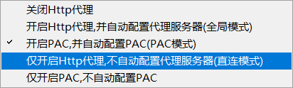

# Windows

## 常用命令

- cmd终端快捷键

```shell
Esc  # 删除当前命令行
```

## v2RAY代理

### 如何配置



1. 关闭Http代理
2. 【全局模式】开启Http代理，并自动配置代理服务器
3. 【PAC模式】开启PAC，并自动配置PAC

```shell
#简介
Proxy auto-config，简称PAC。
PAC模式（仅代理pac列表里的网站或服务器），PAC就是一种配置，它能让你的浏览器智能判断哪些网站走代理，哪些不需要走代理。
pac会自动更新，如果你访问的网站被墙了而不在pac列表里，那么就需要自己手动将网址或者IP添加到pac列表中。

#优势
不影响国内网站的访问速度，防止无意义的绕路。节省服务器资源。

#配置
【示例】例如"||ip138.com", ，注意不要忘记了 , 半角逗号，那么意思就是所有 ip138.com域名下的网址都将走代理。
【通配符】
比如 *.example.com/* 实际书写时可省略 * ， 如.example.com/ ， 和 *.example.com/* 效果一样
【正则】
以 \ 开始和结束， 如 \[\w]+:\/\/example.com\
【例外规则@@】
如 @@*.example.com/* 满足 @@ 后规则的地址不使用代理
【匹配地址开始和结尾 |】
如 |http://example.com 、 example.com| 分别表示以 http://example.com 开始和以 example.com 结束的地址
【|| 标记】
如 ||example.com 则 http://example.com 、https://example.com 、 ftp://example.com 等地址均满足条件
【注释 !】
```


4. 【直连模式】仅开启Http代理，不自动配置代理服务器

5. 仅开启PAC，不自动配置PAC

```shell
#说明
启用pac模式代理，但是不会自动在系统配置pac代理，需要手工填充。
#用途
满足某些人的特殊要求而设计的功能。
比如不需要全局生效，只chrome走代理的时候就可以打开这个，然后 chrome添加参数 -proxy-pac-url=http://127.0.0.1:10810/pac/ ，这样就不干扰其他的app了。
```


