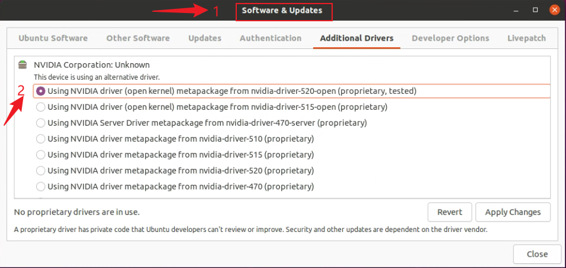

# Anaconda

## Ubuntu安装

- Ubuntu安装Anaconda

root用户安装或普通用户安装

```shell
bash Anaconda3-5.3.1-Linux-x86_64.sh  #安装anaconda

sudo vim ~/.bashrc  #配置环境变量，输入python显示的是conda环境中的python
【在文件最后加上路径】export PATH="/root/anaconda3/bin:$PATH"

source ~/.bashrc  #重新生效配置文件
```

验证安装成功

```shell
conda --version  #查看conda版本
jupyter notebook --allow-root  #查看jupyter
```

常用命令

```shell
conda activate  #激活conda
conda deactivate  #退出conda
conda config --set auto_activate_base false  #取消默认加载conda

conda env list  #查看condau
```

## Windows安装

### 环境问题

- powershell无法激活conda

```shell
# 命令行打开powershell
win+X快捷键
# 输入命令
conda init powershell
# 查看状态是否被禁止
get-ExecutionPolicy
# 打开状态
set-ExecutionPolicy RemoteSigned
```


# Pytorch

## ubuntu安装pytorch

1. 检查显卡、显卡驱动。参照同小节“ubuntu安装显卡驱动”。
2. 安装anaconda。参照“Anaconda”。

## 安装jupyter

- 使用conda安装

```shell
conda update conda  #升级conda
conda install jupyter notebook  #安装jupyter
```

- 安装jupyter kernel虚拟环境

```shell
1）在指定环境安装ipykernel
进入指定虚拟环境，输入安装命令
# 激活指定环境
conda activate torch18
# 安装命令
pip install ipykernel

2）输入命令：前面的环境名称为指定虚拟环境的名称， 后者为在jupyter notebook显示的名称（后者可任意定义）
python -m ipykernel install --user --name 环境名称 --display-name “环境名称”
```

- 删除jupyter指定虚拟环境

```shell
进入已安装jupyter notebook的虚拟环境【可以是base】
jupyter kernelspec list  #查看jupyter

jupyter kernelspec remove [kernel_name]  #删除指定核心
```

- 设置jupyter工作路径

```shell
jupyter-notebook --generate-config  #找到或者新建配置文件

在文档中添加如下命令：
c.NotebookApp.notebook_dir = 'working directory'  或者
c.ServerApp.root_dir = 'working directory'

ctrl+h  #linux打开/关闭影藏文件
```


## Windows安装pytorch

1. 检查显卡、显卡驱动。百度即可。
2. 安装anaconda。参照“Anaconda”。
3. 官网搜索命令安装。

### 常用命令

```shell
# 环境名称：pytorchhgx 依赖的python版本：3.6 可以在"Anaconda3\envs\"目录下查看环境文件
conda create -n pytorchhgx python=3.6 -y
# 激活环境
conda activate pytorchhgx
# 取消激活
conda deactivate
# 查看当前环境有哪些包
pip list/conda list
# 检查pytoch是否安装成功
python
import torch
exit() / quit()#退出python状态
# 检查pytorch是否可以使用GPU
torch.cuda.is_available()
# 查看已有的环境
conda info --envs
# 删除创建的虚拟环境
conda remove -n 环境名 --all
# conda 虚拟环境可以正常使用启动，但是conda目录下的envs为空
给文件的普通用户添加管理员权限；或者使用管理员权限打开文件
```

- jupyter

```shell
## jupyter notebook
# jupyter不显示新安装的pytorch环境
使用管理员打开anaconda【没有文件夹的写入权限】
# 启动jupyter
【cmd输入】
jupyter notebook
# 打开jupyter网页
【浏览器输入】
localhost:8888
# jupyter命令模式【蓝色】与编辑模式【绿色】切换
Enter 命令模式->编辑模式
ESC 编辑模式->命令模式
# jupyter其他命令【命令模式】
"Shift + Enter"  运行jupyter代码块且移动到下一个代码块
"Ctrl + Enter" 运行jupyter代码块且停留在当前代码块
"dd" 删除当前代码块
"b" 在下方添加一个空代码块
"a" 在上方添加一个空代码块
"m" 设为Markdown代码块
"y" 设为python代码块


# 更新pip
python -m pip install --upgrade pip
# 为了让Jupyter Notebook支持虚拟运行环境，需要在Anaconda里安装一个插件
【安装在base环境】conda install nb_conda
# 解决内核无法连接问题
【卸载ipykernel】
conda uninstall ipykernel
【重装ipykernel】
python -m pip install ipykernel
【升级ipykernel】
pip install --upgrade ipykernel
# jupyter不显示pytorch
python -m ipykernel install --name pytorch02
```

- conda问题

```shell
## 解决cuda使用问题
# 【1】查看GPU是否支持cuda
https://www.geforce.cn/hardware/technology/cuda/supported-gpus
# 【1】windows查看显卡与cuda版本
打开nvidia控制面板，点击"系统信息"【左下角】
# 【2】查看cuda版本与驱动版本是否适配
https://docs.nvidia.com/cuda/cuda-toolkit-release-notes/index.html#title-resolved-issues
# 【2】查看驱动版本。可以查看“驱动”、“cuda"版本信息
nvidia-smi
# 【2-1】驱动下载
nvidia官网：https://www.nvidia.cn/
# 【3】查看是否安装的cpu版的pytorch
conda list
# 卸载pytorch
conda uninstall pytorch
# 安装pytorch
【官网】
https://pytorch.org/get-started/locally/
```

- pytorch慢到无法安装

```shell
# Pytorch慢到无法安装问题
【清华源问题】增加"win-64"
http://mirrors.tuna.tsinghua.edu.cn/anaconda/pkgs/main/win-64/
http://mirrors.tuna.tsinghua.edu.cn/anaconda/pkgs/free/win-64/
#1.查看是否安装相关镜像源
conda config --show 【显示所有配置】
conda config --show-sources 【显示添加的源通道】
conda config --show channels 【显示所有镜像通道路径命令】
如：
channels:...
#2.添加镜像源
conda config --add channels https://mirrors.tuna.tsinghua.edu.cn/anaconda/cloud/pytorch/
#3.移除镜像源
conda config --remove channels
#4.恢复默认源
conda config --remove-key channels
#5.显示检索路径，每次安装包时会将包源路径显示出来
conda config --set show_channel_urls yes
conda config --set always_yes True
#【参考链接】https://cloud.tencent.com/developer/article/1588508
```

### 显卡驱动

- 查看电脑的显卡是否支持cuda

方法1：进入网址https://www.geforce.cn/hardware/technology/cuda/supported-gpus

方法2：打开NVIDIA控制面板->系统信息->组件

依据显卡是否支持cuda，在pytorch官网选择对应的pytorch安装命令。

### 安装python编辑器

pycharm

jupyter（交互式）

```shell
# 在pytorch环境中安装jupyter
进入pytorch环境，安装依赖
conda install nb_conda
```


## ubuntu安装显卡驱动

【参考引用】：[CSDN链接](https://blog.csdn.net/m0_54792870/article/details/112980817)、[CSDN2](https://blog.csdn.net/wm9028/article/details/110268030)

### 法1.添加源安装NVIDIA驱动

【图】添加源（可能有问题）



### 法2.命令行安装显卡驱动

```shell
ubuntu-drivers devices  #查看推荐的驱动“recommended”

sudo apt install nvidia-440  #安装指定版本驱动【sudo apt install 指定版本的nvdia驱动器】
sudo ubuntu-drivers autoinstall  #安装推荐版本驱动

sudo reboot  #重启
nvidia-smi  #验证驱动安装成功

sudo apt-get purge nvidia-*  #卸载驱动
```

### 法3.NVIDIA官网下载驱动安装(常用)

1）查询显卡信息

```shell
lspci | grep -i vga  #查看显卡型号
lspci | grep -i nvidia  #查看显卡型号

nvidia-detector  #查看已安装驱动
dpkg -l |grep nvidia  #查看显卡是否正常
nvidia-smi  #查看驱动详细信息
```

第一种：直接输出型号“GeForce GTX 1060 Mobile 6GB”，表示该设备的独立显卡型号

第二种：没有直接打印出具体型号，这时我们需要借助PCI索引平台去获取显卡型号信息: [PCI ID Repository](http://pci-ids.ucw.cz/mods/PC/10de?action=help?help=pci)

[GeForce驱动程序下载地址](https://www.nvidia.cn/geforce/drivers/)

[NVIDIA所有驱动程序下载](https://www.nvidia.cn/Download/index.aspx?lang=cn)

2）关闭显示模式（可选）

```shell
同时按住 Ctrl+Alt+F1 进入tty1终端模式，并且输入下面命令
sudo service lightdm stop  #关闭显示管理
```

3）禁用开源驱动nouveau

```shell
Ubuntu默认内置了Nvidia的第三方jiuhaole开源驱动nouveau，在安装nvidia驱动的时候，会和nouveau驱动冲突:
sudo vim /etc/modprobe.d/blacklist.conf

在blacklist.conf中添加：
blacklist nouveau
options nouveau modeset=0

执行命令：
sudo update-initramfs -u
sudo reboot
```

3）安装驱动

```shell
sudo ./NVIDIA-Linux-x86_64-430.64.run --no-opengl-files  #安装驱动
sudo ./NVIDIA-Linux-x86_64-455.45.01.run -no-x-check -no-nouveau-check -no-opengl-files #【安装驱动】-no-x-check：安装驱动时关闭X服务 -no-nouveau-check：安装驱动时禁用nouveau -no-opengl-files：只安装驱动文件，不安装OpenGL文件

sudo reboot  #重启
nvidia-smi  #验证安装
```

### 重新安装【简版】

```shell
# 禁用nouveau驱动
lsmod | grep nouveau  【查看是否已禁用】

# 禁用nouveau驱动步骤
Ubuntu默认内置了Nvidia的第三方jiuhaole开源驱动nouveau，在安装nvidia驱动的时候，会和nouveau驱动冲突:
sudo vim /etc/modprobe.d/blacklist.conf

在blacklist.conf中添加：
blacklist nouveau
options nouveau modeset=0

执行命令：
sudo update-initramfs -u
sudo reboot
```

```shell
#  卸载原有驱动
sudo apt-get remove --purge nvidia*

# 安装
sudo service lightdm stop //按Ctrl+Alt+F1，关闭图形界面（黑屏）
sudo chmod a+x NVIDIA-Linux-x86_64-xxx.run //修改权限
sudo ./NVIDIA-Linux-x86_64-390.77.run -no-x-check -no-nouveau-check -no-opengl-files //安装
如果找不到文件，那么说明文件名写错或者文件损坏。
sudo service lightdm start

# 安装验证
nvidia-smi//显示GPU当前的状态
```

### 重新安装2

【问题】重新卸载安装

1. 禁用开源驱动nouveau

```shell
Ubuntu默认内置了Nvidia的第三方jiuhaole开源驱动nouveau，在安装nvidia驱动的时候，会和nouveau驱动冲突:
sudo vim /etc/modprobe.d/blacklist.conf

在blacklist.conf中添加：
blacklist nouveau
options nouveau modeset=0

执行命令：
sudo update-initramfs -u
sudo reboot

lsmod | grep nouveau  #查看是否使用nouveau驱动
```

2. 卸载nvidia

```shell
验证是否卸载成功：
cat /proc/driver/nvidia/version
nvidia-smi
dkms status
lsmod | grep nvidia
nvidia-detector  #查看已安装驱动
dpkg -l |grep nvidia  #查看显卡是否正常

卸载命令：
sudo ./NVIDIA-Linux-x86_64-470.74.run --uninstall  #进入驱动文件目录（runfile安装）
sudo apt-get remove --purge nvidia*  #卸载显卡
sudo apt autoremove
sudo /usr/bin/nvidia-uninstall
sudo reboot  #重启
```

3. 重新安装

尽量采用从ubuntu镜像源安装的方式

```shell
ubuntu-drivers devices  #查看推荐的驱动“recommended”

sudo apt install nvidia-440  #安装指定版本驱动【sudo apt install 指定版本的nvdia驱动器】
sudo ubuntu-drivers autoinstall  #安装推荐版本驱动
```

【问题】完全卸载

```shell
sudo ./NVIDIA-Linux-x86_64-470.74.run --uninstall  #进入驱动文件目录（runfile安装）
sudo apt-get remove --purge nvidia*  #卸载显卡
sudo apt autoremove
sudo /usr/bin/nvidia-uninstall
sudo reboot  #重启
```

卸载掉nvidia的驱动后，要重启机器一次。重启后不能进入系统，不要惊慌，这是很正常的，因为驱动被卸载掉了。此时按组合键**Ctrl + Alt + F3**进入tty模式，继续安装新的驱动程序即可。

### 常见问题

【问题】sudo: ./NVIDIA-Linux-x86_64-520.56.06.run: command not found

```shell
这是没有赋予驱动写的权限，执行如下命令
chmod +x NVIDIA-Linux-x86_64-520.56.06.run
```


# Python

## 安装Pycharm

- ubuntu安装pycharm

```shell
官网下载linux社区版pycharm

tar -zvxf pycharm-professional-2022.1.3.tar.gz  #解压文件
sudo mv pycharm-community-2020.2.3/ /opt/   #将软件移动到opt目录下

进到conda环境里后再开始安装，在bin文件夹执行命令：
cd /opt/pycharm-community-2020.2.3/bin  #进入目录
./pycharm.sh 或 sh pycharm.sh  #安装命令

新建文件夹，用这个语句打开：
charm .
```

卸载pycharm

```shell
sudo rm -r /opt/pycharm-community-2020.2.3/  # 删除程序相关文件
rm -r ~/.config/JetBrains/PyCharmCE2020.2  # 删除配置信息相关文件
rm -r ~/.cache/JetBrains/PyCharmCE2020.2  # 删除缓存文件
sudo rm /usr/share/applications/jetbrains-pycharm-ce.desktop  # 删除快捷方式
```


## 安装第三方库

### 使用pip install

```shell
pip install 包名 -i http://pypi.douban.com/simple/ --trusted-host pypi.douban.com  #指定镜像源，并添加信任

python -m pip install --upgrade pip  #升级pip
```

### 使用Pycharm

### 离线安装

- pip安装whl文件

[下载地址1](https://www.lfd.uci.edu/~gohlke/pythonlibs/#genshi)

[下载地址2](https://pypi.org/)

```shell
在"下载地址"中下载对应版本

文件下载好以后把它移动到python目录的Scripts下方。

cmd调出黑框进行安装命令：pip install wordcloud-1.6.0-cp38-cp38-win_amd64.whl 
```

- conda安装本地.whl文件

```shell
打开anaconda commond prompt
cd 到whl文件夹
pip install whl文件名
```


- github下载安装

```shell
python setup.py install
```

### 常见问题

【问题】

```shell
ERROR: Could not find a version that satisfies the requirement 包名
ERROR: No matching distribution found for 包名
```

解决方法

```shell
pip install -i https://pypi.tuna.tsinghua.edu.cn/simple 包名  #指定镜像源
pip install 包名 -i http://pypi.douban.com/simple/ --trusted-host pypi.douban.com  #指定镜像源，并添加信任

python -m pip install --upgrade pip  #升级pip
```

## 环境配置

基础介绍

- 说明：目前python有两个版本，2.x版和3.x版，这两个版本不兼容。python3.x版越来越流行。

- 官网下载python：http://www.python.org/download/

- 安装完成后，需要添加两个路径到环境变量

  

## python第三方库安装方法

### 直接使用pip install安装

前提：将"python/Scripts/"添加到系统环境变量中。

注意：先输入pip list检查是否需要更新pip。

更新pip命令：python -m pip install --upgrade pip

pip install 库名

### 下载whl文件再安装

注意下载对应版本。第三方库文件下载地址：

https://www.lfd.uci.edu/~gohlke/pythonlibs/#genshi

https://pypi.org

下载完成后，将.whl文件放到python安装目录下的 *\Lib\site-packages* 路径下。

然后打开cmd，输入`pip install`以后，把.whl **拖 进 来**，回车即可安装。


### 在pycharm中安装


### 通过国内源进行安装（推荐使用，下载速度会比较快）

```shell
清华：https://pypi.tuna.tsinghua.edu.cn/simple
阿里：https://mirrors.aliyun.com/pypi/simple/
中科大：https://pypi.mirrors.ustc.edu.cn/simple/
```

使用方法很简单 只需要到cmd当中输入指令：

pip install -i https源地址 库名  即可

例如安装requests：

pip install -i [https://pypi.tuna.tsinghua.edu.cn/simple](https://link.zhihu.com/?target=https%3A//pypi.tuna.tsinghua.edu.cn/simple) requests

### 使用conda安装

安装问题：python安装路径下的Script->sitepackages中没有pip包。

原因：之前安装过conda，重新安装python解释器时自动将Script->sitepackages安装到另外的目录下。


# 资料集

## 镜像源

- conda镜像源

```shell
#【国内常用conda镜像源】
清华源
https://mirrors.tuna.tsinghua.edu.cn/anaconda/pkgs/main
https://mirrors.tuna.tsinghua.edu.cn/anaconda/pkgs/free/
https://mirrors.tuna.tsinghua.edu.cn/anaconda/cloud
https://mirrors.tuna.tsinghua.edu.cn/anaconda/pkgs/r
https://mirrors.tuna.tsinghua.edu.cn/anaconda/pkgs/msys2
阿里云
https://mirrors.aliyun.com/anaconda/
北外源
https://mirrors.bfsu.edu.cn/anaconda/
北大源
https://mirrors.pku.edu.cn/anaconda/
```

- Python国内镜像地址

```shell
#Python国内镜像地址
清华：https://pypi.tuna.tsinghua.edu.cn/simple
阿里云：http://mirrors.aliyun.com/pypi/simple/
中国科技大学 https://pypi.mirrors.ustc.edu.cn/simple/
华中理工大学：http://pypi.hustunique.com/
山东理工大学：http://pypi.sdutlinux.org/
豆瓣：http://pypi.douban.com/simple/
```


- 开源软件镜像站

```shell
https://mirrors.tuna.tsinghua.edu.cn/  #清华大学
```

