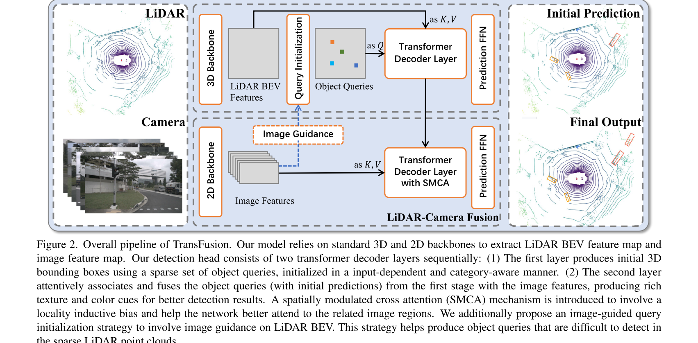

# PointNet系列

## PointNet

### 点云特征

1. 点云是一个无序性的集合【输入的顺序不能改变模型提取到的特征】

- 解决方法：对称函数【如max函数】

- 如何利用神经网络构造对称函数？


- 采用多层感知机升维，以降低信息的损失


- PointNet的网络结构能够拟合任意的连续集合函数Universal Set Function Approximator【多层感知机也能】

2. 点云集合具有旋转不变性【不同角度看同一个物体的点云，模型输出的分类结果都应该一致】

- 解决方法：设计Transformer网络
- 数据角度自动对阵变换【矩阵乘法】


- 特征对准【弃用】


3. 点云近密远疏【采集特征】
4. 点之间具有相互关联的信息，这意味着每个点都不是孤立的，所以需要模型具有可以提取点与相邻点局部特征的能力。

### 网络结构

- 分类网络


- 分割网络

n：输入的点。m：输出的分割类别


### 研究进展

|   点云特征表达    | 举例             |    网络结构     |                          缺点                           |
| :---------------: | ---------------- | :-------------: | :-----------------------------------------------------: |
|  栅格化（体素）   | VoxelNet、SECOND |     3D CNN      |                3D卷积的瓶颈。有信息丢失                 |
|   投影（BEV ）    | MVOD             |     2D CNN      | 虽然时间更快, 但是点云的稀疏性让卷积的不实用,效率很低。 |
| 特征提取/特征学习 | PointNet         | Fully Connected |                        计算复杂                         |

## PointNet++

### 提出背景

- 主要思想：借鉴多层卷积神经网络
- PointNet用最大池化，缺点是每个点其局部特征没有学习到


### PointNet++的贡献

1. 多层级（多尺度）特征学习

- 功能：学习每个点的局部特征


2. 旋转不变性

3. 排列/排序不变性

### 多层级特征提取结构

- 采样


- 分组


- 特征学习


### 对于非均匀点云的处理

- 背景

点云数据具有近密远疏的特征。

- 方法【特征拼接】


## 代码实战

### 环境

- 配置pytorch

```shell
python3.7
conda install pytorch==1.1.0 torchvision==0.3.0 cudatoolkit=10.0 -c pytorch
```

- 拉取项目代码

```shell
git clone https://github.com/yanx27/Pointnet_Pointnet2_pytorch.git
```


# ResNet-VGG

# FPN

- [Feature Pyramid Networks for Object Detection](https://arxiv.org/abs/1612.03144)


# Faster-RCNN、Yolo、SSD、RetinaNet

## Faster-RCNN

- Towards Real-Time Object Detection with Region Proposal Networks


## Yolo


## SSD

- Single Shot MultiBox Detector


## RetinaNet

- Focal Loss for Dense Object Detection


- 模型数据流图


## End-to-End Object Detection with Transformers


# Voxel-Second-Pointpillars、Center-based

## VoxelNet


## Second

- 对VoxelNet的改进


## Pointpillars


## Center-based

- Center-based 3D Object Detection and Tracking


# AVOD、MV3D、MMVX-Net、PointFusion、Multi-View Fusion

## AVOD

- Aggregate View Object Detection


## MV3D

- Multi-View 3D object detection network (MV3D)


## MMVX-Net

- Multimodal VoxelNet for 3D Object Detection


## PointFusion

- Deep Sensor Fusion for 3D Bounding Box Estimation


## End-to-End Multi-View Fusion

- End-to-End Multi-View Fusion for 3D Object Detection in LiDAR Point Clouds


# PointRCNN-PVRCNN-PV++RCNN

## PointRCNN

- 3D Object Proposal Generation and Detection from Point Cloud


- 方法对比


## PV-RCNN

- Point-Voxel Feature Set Abstraction for 3D Object Detection


- 特点


##  PV-RCNN++

- Point-Voxel Feature Set Abstraction With Local Vector Representation for 3D Object Detection


# SE-SSD、TransFusion、CAT-Det

## SE-SSD

- Self-Ensembling Single-Stage Object Detector From Point Cloud


- 研究进展


## TransFusion

- TransFusion: Robust LiDAR-Camera Fusion for 3D Object Detection with Transformers



## CAT-Det

- CAT-Det: Contrastively Augmented Transformer for Multi-modal 3D Object Detection


# Transformer

## RNN

- 【示例】：预测今天吃什么


昨天做的菜和今天的天气，一起影响今天做的菜。


- 图解


权重W、U、V是共享的。


上述的隐藏层并不是一个单一的神经元，它是一个包含多个神经元的隐藏层。


## LSTM【改进RNN记住长序列信息问题】

- 图解


## seq2seq【改进RNN无法应对变长IO问题】

Seq2Seq 是一种循环神经网络的变种，包括编码器 (**Encoder**) 和解码器 (**Decoder**) 两部分。Seq2Seq 是自然语言处理中的一种重要模型，可以用于机器翻译、对话系统、自动文摘。Seq2Seq 是一种重要的 RNN 模型，也称为 Encoder-Decoder 模型，可以理解为一种 **N×M** 的模型。模型包含两个部分：**Encoder** 用于编码序列的信息，将任意长度的序列信息编码到一个向量 **c** 里。而 **Decoder** 是解码器，解码器得到上下文信息向量 **c** 之后可以将信息解码，并输出为序列。

【seq2seq解决的问题】RNN 的输入和输出个数都有一定的限制，但实际中很多任务的序列的长度是不固定的，例如机器翻译中，源语言、目标语言的句子长度不一样；对话系统中，问句和答案的句子长度不一样。

<video id="video" controls=""src="TyporaImg/网络模型汇总/seq2seq_3.mp4" preload="none">

- 图解【Encoder 与一般的 RNN 区别不大，只是中间神经元没有输出】

第一种


解码器


第二种


解码器


第三种


解码器


## Attention【改进seq2seq由长序列到定长向量转化而造成信息损失的瓶颈问题】

在 Seq2Seq 模型，Encoder 总是将源句子的所有信息编码到一个固定长度的上下文向量 **c** 中，然后在 Decoder 解码的过程中向量 **c** 都是不变的。这存在着不少缺陷：

- 对于比较长的句子，很难用一个定长的向量 **c** 完全表示其意义。
- RNN 存在长序列梯度消失的问题，只使用最后一个神经元得到的向量 **c** 效果不理想。
- 与人类的注意力方式不同，即人类在阅读文章的时候，会把注意力放在当前的句子上。

使用了 Attention 后，Decoder 的输入就不是固定的上下文向量 **c** 了，而是会根据当前翻译的信息，计算当前的 **c**。

- 图解


- 视频

<video id="video" controls=""src="TyporaImg/网络模型汇总/seq2seq_4.mp4" preload="none">

<video id="video" controls=""src="TyporaImg/网络模型汇总/seq2seq_5.mp4" preload="none">

<video id="video" controls=""src="TyporaImg/网络模型汇总/seq2seq_6.mp4" preload="none">

<video id="video" controls=""src="TyporaImg/网络模型汇总/seq2seq_8.mp4" preload="none">

<video id="video" controls=""src="TyporaImg/网络模型汇总/seq2seq_9.mp4" preload="none">
## Attention系列发展

**参考引用**

- [The Illustrated Transformer](https://jalammar.github.io/illustrated-transformer/)

- [Attention机制详解](https://zhuanlan.zhihu.com/p/47063917)

### 早期attention

- RNN的问题


这个结构有些问题，尤其是RNN机制实际中存在长程梯度消失的问题，对于较长的句子，我们很难寄希望于将输入的序列转化为定长的向量而保存所有的有效信息，所以随着所需翻译句子的长度的增加，这种结构的效果会显著下降。

- 早期注意力机制

当我们翻译“knowledge”时，只需将注意力放在源句中“知识”的部分，当翻译“power”时，只需将注意力集中在"力量“。这样，当我们decoder预测目标翻译的时候就可以看到encoder的所有信息，而不仅局限于原来模型中定长的隐藏向量，并且不会丧失长程的信息。

<video id="video" controls=""src="TyporaImg/网络模型汇总/attention.mp4" preload="none">
### self-attention与tansformer
既然Attention模型本身可以看到**全局**的信息， 那么一个自然的疑问是我们能不能去掉RNN结构，仅仅依赖于Attention模型呢，这样我们可以使训练**并行**化，同时拥有全局信息？

### self-attention和transformer

- transformer

先来看一个翻译的例子“I arrived at the bank after crossing the river” 这里面的bank指的是银行还是河岸呢，这就需要我们联系上下文，当我们看到river之后就应该知道这里bank很大概率指的是河岸。在RNN中我们就需要一步步的顺序处理从bank到river的所有词语，而当它们相距较远时RNN的效果常常较差，且由于其顺序性处理效率也较低。Self-Attention则利用了Attention机制，**计算每个单词与其他所有单词之间的关联**，在这句话里，当翻译bank一词时，**river一词就有较高的Attention score**。利用这些Attention score就可以得到一个加权的表示，然后再放到一个前馈神经网络中得到新的表示，这一表示很好的考虑到上下文的信息。如下图所示，encoder读入输入数据，利用层层叠加的Self-Attention机制对每一个词得到新的考虑了上下文信息的表征。Decoder也利用类似的Self-Attention机制，但它不仅仅看之前产生的输出的文字，而且还要attend encoder的输出。以上步骤如下动图所示：

<video id="video" controls=""src="TyporaImg/网络模型汇总/transformer.mp4" preload="none">

架构图


Multi-head Attention其实就是多个Self-Attention结构的结合，每个head学习到在不同表示空间中的特征，如下图所示，两个head学习到的Attention侧重点可能略有不同，这样给了模型更大的容量。


- self-attention

架构图


计算公式


编码器


解码器


# 加视频

```shell
# 命令
<video id="video" controls=""src="TyporaImg/网络模型汇总/seq2seq_3.mp4" preload="none">
```

